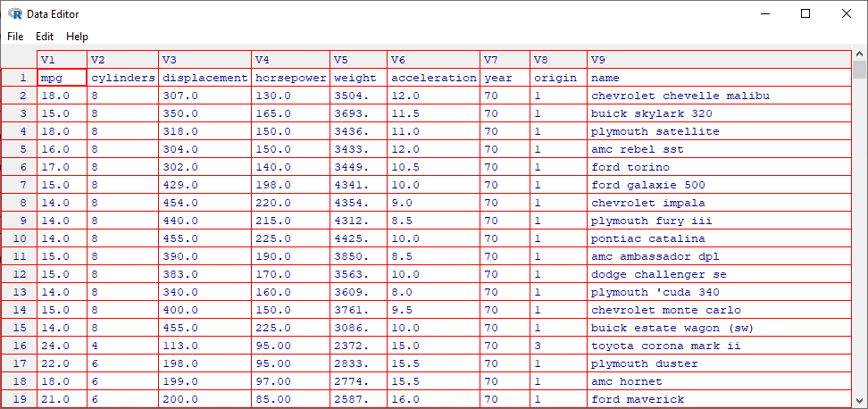
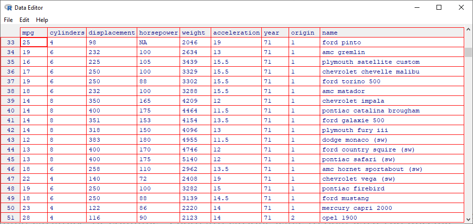
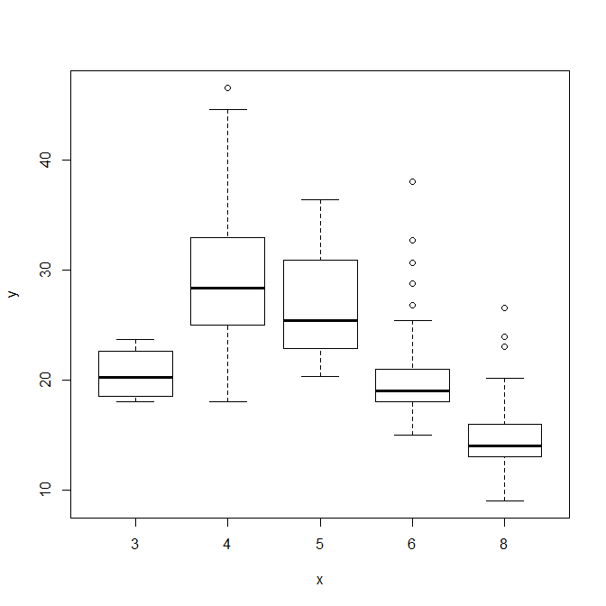
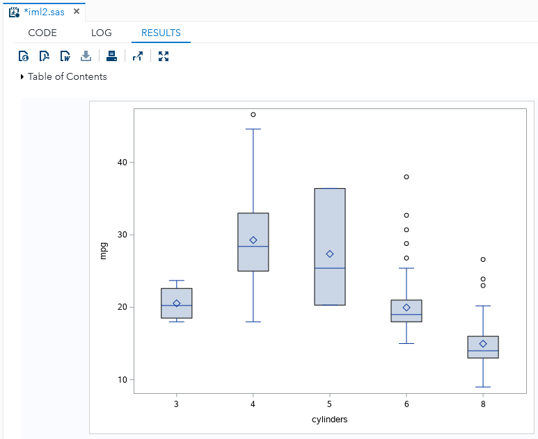
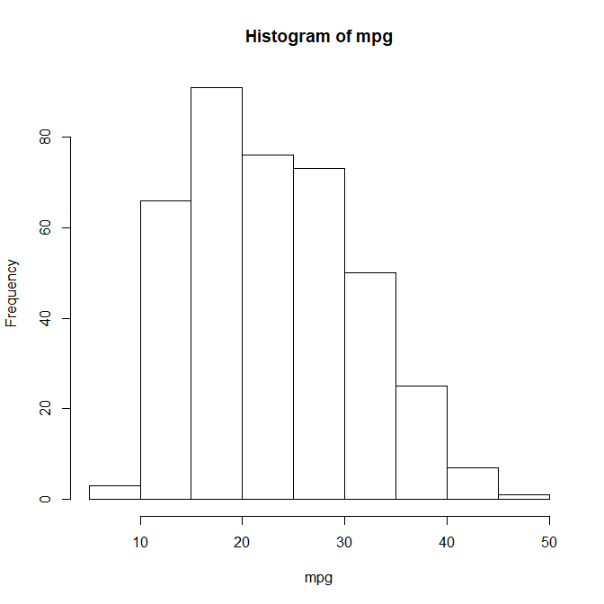
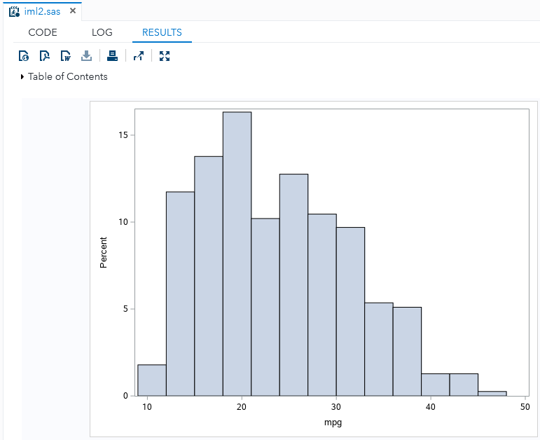
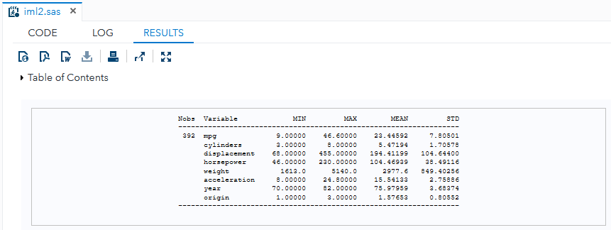

# ISL**R** Lab → SAS/IML

This is a record of exploring whether features of R can be reproduced in 
SAS/IML and so shall provide demonstrations where it does and alternatives 
where it doesn't. 

**Equivalent or approximate SAS/IML codes may exist beyond the codes shown in this document.**

This is NOT intended to be a tutorial of any sort.

The *Lab* sections of ISLR 7th printing will be used as basis.

## Contents
* ISLR [2.3.1 Basic Commands](#231-Basic-Commands)
    * R [Declaring a vector](#declaring-a-vector-p43)
    * SAS/IML [Row vectors vs column vectors](#row-vectors-vs-column-vectors)
    * R [Getting the vector length](#getting-the-vector-length-p43)
    * R [Vector addition](#vector-addition-p43)
    * R [Functions `ls()` and `rm()`](#functions-ls-and-rm-p43)
    * R [Making a matrix](#making-a-matrix-p44)
    * R [Function `sqrt()`](#function-sqrt-p44)
    * R [Caret operator (`^`)](#caret-operator--p45)
    * R [Random numbers in normal distribution](#random-numbers-in-normal-distribution-p45)
    * R [Function `set.seed()`](#function-setseed-p45)
    * R [Functions `mean()`, `var()` and `sd()`](#functions-mean-var-and-sd-p45)
* ISLR [2.3.2 Graphics](#232-Graphics)
    * R [Function `plot()`](#function-plot-p45)
    * R [Saving graphs](#saving-graphs-p46)
    * R [Function `seq()`](#function-seq-p46)
    * R [Function `outer()`](#function-outer-p46)
    * R [Functions `contour()`, `image()` and `persp()`](#functions-contour-image-and-persp-p46)
* ISLR [2.3.3 Indexing Data](#233-indexing-data)
    * R [Member access](#member-access-p47)
    * SAS/IML [Function `t()`](#member-access-p47) (used in *Member access* example)
    * R [Function `dim()`](#function-dim-p48)
* ISLR [2.3.4 Loading Data](#234-loading-data)
    * R [Function `read.table()`](#function-readtable-p48)
    * R [Function `read.csv()`](#function-readcsv-p49)
    * R [Function `na.omit()`](#function-naomit-p49)
    * R [Function `names()`](#function-names-p49)
    * R [Function `attach()`](#function-attach-p50)
    * R [Function `as.factor()`](#function-asfactor-p50)
    * R [Boxplots](#boxplots-p50)
    * R [Function `hist()`](#function-hist-p50)
    * R [Function `pairs()`](#function-pairs-p50)
    * R [Function `identify()`](#function-identify-p51)
    * R [Function `summary()` (p.51)](#function-summary-p51)
* ISLR [2.4 Exercises, *Applied*](#24-exercises-applied)
    * R [Function `rep()`](#function-rep-p55)
    * SAS/IML [Function `loc()`](#function-loc) (used in *Codes for Item 8*)
    * R [Function `data.frame()`](#function-dataframe-p55)
    * R [Function `par()`](#function-par-p55)
    * SAS/IML [Codes for Item 8](#codes-for-item-8) (with `SUBMIT`...`ENDSUBMIT`)
    * SAS [Codes for Item 9](#codes-for-item-9) (no `proc iml`)

---

## SAS/IML and R

It is possible to submit R statements in `proc iml`. However, such a feature 
must be enabled since it does not work out of the box. Documentation 
[here](https://documentation.sas.com/?docsetId=imlug&docsetTarget=imlug_r_sect001.htm&docsetVersion=14.3&locale=en).

**SAS University Edition**<br/>
The documentation explicitly states that:
>You cannot call R from the free SAS University Edition. The SAS University 
>Edition runs on a virtual machine that does not have R installed.

**Licensed environments**<br/>
The RLANG system option must be supported by the host. Documentation 
[here](https://documentation.sas.com/?docsetId=imlug&docsetTarget=imlug_r_sect003.htm&docsetVersion=14.3&locale=en).

---

## 2.3.1 Basic Commands

---

### Declaring a vector (p.43)

R code:
```r
x <- c(1,3,2,5)
x
```

R output:
```
[1] 1 3 2 5
```

SAS code:
```sas
proc iml;
    x = { 1, 3, 2, 5 };
    print x;
quit;
```

SAS log:
```
 73         proc iml;
 NOTE: IML Ready
 74             x = { 1, 3, 2, 5 };
 75             print x;
 76         quit;
 NOTE: Exiting IML.
 NOTE: PROCEDURE IML used (Total process time):
       real time           0.02 seconds
       cpu time            0.03 seconds
```

SAS results (HTML):
<table class="table" cellspacing="0" cellpadding="5" rules="all" frame="box" bordercolor="#C1C1C1" summary="Procedure IML: x">
<colgroup>
<col>
</colgroup>
<thead>
<tr>
<th class="c b header" scope="col">x</th>
</tr>
</thead>
<tbody>
<tr>
<td class="r data">1</td>
</tr>
<tr>
<td class="r data">3</td>
</tr>
<tr>
<td class="r data">2</td>
</tr>
<tr>
<td class="r data">5</td>
</tr>
</tbody>
</table>

---

### Row vectors vs column vectors

A vector in SAS/IML is a special matrix with dimensions of either *n*x1 "column 
vector" or 1×*p* "row vector". Documentation
[here](https://documentation.sas.com/?docsetId=imlug&docsetTarget=imlug_languagechap_sect001.htm&docsetVersion=14.3&locale=en).

In contrast, R does not natively distinguish 
between row vectors and column vectors.[*1]

> [*1] Needs verification: "R does not..."

SAS code (additional example):
```sas
proc iml;
    colv = { 1, 2, 3, 4 };
    print colv;

    rowv = { 1  2  3  4 };
    print rowv;
quit;
```

SAS result (HTML):
<table class="table" rules="all" frame="box" summary="Procedure IML: colv" cellspacing="0" cellpadding="5" bordercolor="#C1C1C1">
<colgroup>
<col>
</colgroup>
<thead>
<tr>
<th class="c b header" scope="col">colv</th>
</tr>
</thead>
<tbody>
<tr>
<td class="r data">1</td>
</tr>
<tr>
<td class="r data">2</td>
</tr>
<tr>
<td class="r data">3</td>
</tr>
<tr>
<td class="r data">4</td>
</tr>
</tbody>
</table>

<table class="table" rules="all" frame="box" summary="Procedure IML: rowv" cellspacing="0" cellpadding="5" bordercolor="#C1C1C1">
<colgroup>
<col>
<col>
<col>
<col>
</colgroup>
<thead>
<tr>
<th class="c b header" colspan="4" scope="colgroup">rowv</th>
</tr>
</thead>
<tbody>
<tr>
<td class="r data">1</td>
<td class="r data">2</td>
<td class="r data">3</td>
<td class="r data">4</td>
</tr>
</tbody>
</table>

Note how an explicitly-written row vector does not have commas.

---

### Getting the vector length (p.43)

R:
```
> x = c(1,6,2)
> y = c(1,4,3)
> length(x)
[1] 3
> length(y)
[1] 3
```
SAS code:
```sas
proc iml;
    x = { 1, 6, 2 };
    d = dimension(x);
    print "vector length of x" d;

    y = { 1, 4, 3 };
    d = dimension(y);
    print "vector length of y" d;
quit;
```

Print message added for distinction.

SAS results (HTML):
<table class="table" rules="all" frame="box" summary="Procedure IML: d" cellspacing="0" cellpadding="5" bordercolor="#C1C1C1">
<colgroup>
<col>
<col>
<col>
</colgroup>
<thead>
<tr>
<th class="c headerempty" scope="col">&nbsp;</th>
<th class="r b header" scope="col">d</th>
<th class="c headerempty" scope="col">&nbsp;</th>
</tr>
</thead>
<tbody>
<tr>
<td class="l data">vector length of x</td>
<td class="r data">3</td>
<td class="r data">1</td>
</tr>
</tbody>
</table>
<table class="table" rules="all" frame="box" summary="Procedure IML: d" cellspacing="0" cellpadding="5" bordercolor="#C1C1C1">
<colgroup>
<col>
<col>
<col>
</colgroup>
<thead>
<tr>
<th class="c headerempty" scope="col">&nbsp;</th>
<th class="r b header" scope="col">d</th>
<th class="c headerempty" scope="col">&nbsp;</th>
</tr>
</thead>
<tbody>
<tr>
<td class="l data">vector length of y</td>
<td class="r data">3</td>
<td class="r data">1</td>
</tr>
</tbody>
</table>

Note that the a result of the `dimension(m)` function are two numbers, for the 
number of rows and columns, respectively.

Aternatively if y is a row vector:

SAS code (additional example):
```sas
proc iml;
    y = { 1  4  3 };
    d = dimension(y);
    print "vector length of y" d;
quit;
```

SAS result (HTML):
<table class="table" rules="all" frame="box" summary="Procedure IML: d" cellspacing="0" cellpadding="5" bordercolor="#C1C1C1">
<colgroup>
<col>
<col>
<col>
</colgroup>
<thead>
<tr>
<th class="c headerempty" scope="col">&nbsp;</th>
<th class="r b header" scope="col">d</th>
<th class="c headerempty" scope="col">&nbsp;</th>
</tr>
</thead>
<tbody>
<tr>
<td class="l data">vector length of y</td>
<td class="r data">1</td>
<td class="r data">3</td>
</tr>
</tbody>
</table>

The result of the `dimension(m)` function is also a matrix. Documentation 
[here](https://documentation.sas.com/?docsetId=imlug&docsetTarget=imlug_langref_sect110.htm&docsetVersion=14.3&locale=en).

SAS/IML also has a length function, but does not give the length of a vector. 
Documentation 
[here](https://documentation.sas.com/?docsetId=imlug&docsetTarget=imlug_langref_sect215.htm&docsetVersion=14.3&locale=en).

---

### Vector addition (p.43)

R:
```
> x+y
[1] 2 10 5
```

SAS code:
```sas
proc iml;
    x = { 1, 6, 2 };
    y = { 1, 4, 3 };
    a = x + y;
    print a;
quit;
```

SAS result (HTML):
<table class="table" rules="all" frame="box" summary="Procedure IML: a" cellspacing="0" cellpadding="5" bordercolor="#C1C1C1">
<colgroup>
<col>
</colgroup>
<thead>
<tr>
<th class="c b header" scope="col">a</th>
</tr>
</thead>
<tbody>
<tr>
<td class="r data">2</td>
</tr>
<tr>
<td class="r data">10</td>
</tr>
<tr>
<td class="r data">5</td>
</tr>
</tbody>
</table>

Note that vector addition in SAS/IML is the same operation as matrix addition 
and requires that the two operands have exactly the same dimensions.

SAS code (additional example):
```sas
proc iml;
    x = { 1, 6, 2 };
    y = { 1  4  3 };
    a = x + y;
    print a;
quit;
```

SAS log:
```
 93         proc iml;
 NOTE: IML Ready
 94             x = { 1, 6, 2 };
 95             y = { 1  4  3 };
 96             a = x + y;
 ERROR: (execution) Matrices do not conform to the operation.
```

SAS/IML will not add an *n*×1 matrix and a 1×*p* matrix.

---

### Functions `ls()` and `rm()` (p.43)

R:
```
> ls()
[1] "x" "y"
> rm(x,y)
> ls()
character (0)
```

Corresponding SAS/IML codes for `ls()` and `rm()` are yet to be found.[*2]

> [*2] Needs verification

The SAS/IML `SHOW` statement may display exisitng variables in the environment, 
but there is no way to put the results in a matrix. Documentation
[here](https://documentation.sas.com/?docsetId=imlug&docsetTarget=imlug_langref_sect443.htm&docsetVersion=14.3&locale=en).

---

### Making a matrix (p.44)

R:
```
> x=matrix(data=c(1,2,3,4), nrow=2, ncol=2)
> x
     [,1] [,2]
[1,]    1    3
[2,]    2    4
```

SAS code:
```sas
proc iml;
    x = { 1 3, 2 4 };
    print x;
quit;
```

SAS result (HTML):
<table class="table" rules="all" frame="box" summary="Procedure IML: x" cellspacing="0" cellpadding="5" bordercolor="#C1C1C1">
<colgroup>
<col>
<col>
</colgroup>
<thead>
<tr>
<th class="c b header" colspan="2" scope="colgroup">x</th>
</tr>
</thead>
<tbody>
<tr>
<td class="r data">1</td>
<td class="r data">3</td>
</tr>
<tr>
<td class="r data">2</td>
<td class="r data">4</td>
</tr>
</tbody>
</table>

In SAS/IML, the syntax for explicit declaration is the same for matrices, 
vectors and scalars. Note how spaces and commas in the SAS/IML declaration 
arrange the items in the resulting matrix.

R:
```
> matrix (c(1,2,3,4),2,2,byrow=TRUE)
[,1] [,2]
[1,] 1 2
[2,] 3 4
```

SAS code:
```sas
proc iml;
    x = { 1 2, 3 4 };
    print x;
quit;
```

SAS result (HTML):
<table class="table" rules="all" frame="box" summary="Procedure IML: x" cellspacing="0" cellpadding="5" bordercolor="#C1C1C1">
<colgroup>
<col>
<col>
</colgroup>
<thead>
<tr>
<th class="c b header" colspan="2" scope="colgroup">x</th>
</tr>
</thead>
<tbody>
<tr>
<td class="r data">1</td>
<td class="r data">2</td>
</tr>
<tr>
<td class="r data">3</td>
<td class="r data">4</td>
</tr>
</tbody>
</table>

The behavior of the SAS/IML declaration seems to mimic the `byrow=TRUE` option 
in the R `matrix()` method. Which elements go to which row and column are 
controlled by where commas are placed. Documentation 
[here](https://documentation.sas.com/?docsetId=imlug&docsetTarget=imlug_workmatrix_sect002.htm&docsetVersion=14.3&locale=en).

The closest equivalent in SAS/IML is the `shape()` function. Documentation
[here](https://documentation.sas.com/?docsetId=imlug&docsetTarget=imlug_langref_sect441.htm&docsetVersion=14.3&locale=en).

---

### Function `sqrt()` (p.44)

R:
```
> sqrt(x)
     [,1] [,2]
[1,] 1.00 1.73
[2,] 1.41 2.00
```

SAS code: 
```sas
proc iml;
    x = { 1 3, 2 4};
    a = sqrt(x);
    print a;
quit;
```

SAS result (HTML):
<table class="table" rules="all" frame="box" summary="Procedure IML: a" cellspacing="0" cellpadding="5" bordercolor="#C1C1C1">
<colgroup>
<col>
<col>
</colgroup>
<thead>
<tr>
<th class="c b header" colspan="2" scope="colgroup">a</th>
</tr>
</thead>
<tbody>
<tr>
<td class="r data">1</td>
<td class="r data">1.7320508</td>
</tr>
<tr>
<td class="r data">1.4142136</td>
<td class="r data">2</td>
</tr>
</tbody>
</table>

The `sqrt(m)` function in SAS/IML seems the same as the `sqrt()` function in 
R. Documentation 
[here](https://documentation.sas.com/?docsetId=imlug&docsetTarget=imlug_langref_sect461.htm&docsetVersion=14.3&locale=en).

---

### Caret operator (`^`) (p.45)

R:
```
> x ^ 2
     [,1] [,2]
[1,]    1    9
[2,]    4   16
```

SAS code:
```sas
proc iml;
    x = { 1 3, 2 4};
    a = x ## 2;
    print a;
quit;
```

SAS result (HTML):
<table class="table" rules="all" frame="box" summary="Procedure IML: a" cellspacing="0" cellpadding="5" bordercolor="#C1C1C1">
<colgroup>
<col>
<col>
</colgroup>
<thead>
<tr>
<th class="c b header" colspan="2" scope="colgroup">a</th>
</tr>
</thead>
<tbody>
<tr>
<td class="r data">1</td>
<td class="r data">9</td>
</tr>
<tr>
<td class="r data">4</td>
<td class="r data">16</td>
</tr>
</tbody>
</table>

The elementwise power operator (`##` in `m ## s`) raises each element in matrix 
`m` to the scalar `s`-th power. Documentation
[here](https://documentation.sas.com/?docsetId=imlug&docsetTarget=imlug_langref_sect045.htm&docsetVersion=14.3&locale=en).

The caret operator in SAS/IML is a prefix operator for logical NOT. 
Documentation 
[here](https://documentation.sas.com/?docsetId=imlug&docsetTarget=imlug_langref_sect042.htm&docsetVersion=14.3&locale=en).

SAS/IML also has a matrix power operator (`**` in `m ** s`), which multiples a 
matrix `m` by itself `s` times. Documentation 
[here](https://documentation.sas.com/?docsetId=imlug&docsetTarget=imlug_langref_sect046.htm&docsetVersion=14.3&locale=en).

---

### Random numbers in normal distribution (p.45)

R:
```
> x=rnorm(50)
> y=x+rnorm(50,mean=50,sd=.1)
> cor(x,y)
[1] 0.995
```

SAS code:
```sas
proc iml;
    x = randfun(50, "Normal");
    y = x + randfun(50, "Normal", 50, 0.1);
    m = x || y;
    c = corr(m);
    print c;
quit;
```

SAS result (HTML):
<table class="table" rules="all" frame="box" summary="Procedure IML: c" cellspacing="0" cellpadding="5" bordercolor="#C1C1C1">
<colgroup>
<col>
<col>
</colgroup>
<thead>
<tr>
<th class="c b header" colspan="2" scope="colgroup">c</th>
</tr>
</thead>
<tbody>
<tr>
<td class="r data">1</td>
<td class="r data">0.9952377</td>
</tr>
<tr>
<td class="r data">0.9952377</td>
<td class="r data">1</td>
</tr>
</tbody>
</table>

The SAS/IML function `randfun()` may accept other types of distribution 
other than "Normal". Documentation 
[here](https://documentation.sas.com/?docsetId=imlug&docsetTarget=imlug_langref_sect336.htm&docsetVersion=14.3&locale=en).

There is also `randnormal(n, mean, cov)` that has a different third parameter. 
Documentation 
[here](https://documentation.sas.com/?docsetId=imlug&docsetTarget=imlug_langref_sect375.htm&docsetVersion=14.3&locale=en).

The `corr()` function computes a *sample* correlation. Accepts a matrix and 
outputs a matrix. The function does not accept mutiple vectors as in R. 
Multiple vectors must be combined into a *m*×*p* matrix. Documentation 
[here](https://documentation.sas.com/?docsetId=imlug&docsetTarget=imlug_langref_sect085.htm&docsetVersion=14.3&locale=en).

To put the column vectors x and y into once matrix they were concatenated using 
the horizontal concatenation operator `||`. Documentation 
[here](https://documentation.sas.com/?docsetId=imlug&docsetTarget=imlug_langref_sect032.htm&docsetVersion=14.3&locale=en).

---

### Function `set.seed()` (p.45)

R:
```
> set.seed(1303)
> rnorm(50)
[1] -1.1440 1.3421 2.1854 0.5364 0.0632 0.5022 -0.0004
...
```

Note that different builds of R (64-bit vs 32-bit, Windows vs Unix, etc.) may 
have differences in results. Consecutive calls to `rnorm()` will move the 
random number generator forward:

R (additional example):
```
> set.seed(1303)    # seed set to 1303
> rnorm(5)          # shows random numbers 1-5 for seed 1303
[1] -1.14397631  1.34212937  2.18539048  0.53639252  0.06319297
>
> set.seed(1303)    # seed set to 1303
> rnorm(5)          # shows random numbers 1-5 for seed 1303
[1] -1.14397631  1.34212937  2.18539048  0.53639252  0.06319297
>
> rnorm(5)          # shows random numbers 6-10 for seed 1303
[1]  0.5022344825 -0.0004167247  0.5658198405 -0.5725226890 -1.1102250073
>
> set.seed(1303)    # seed set to 1303
> rnorm(10)         # shows random numbers 1-10 for seed 1303
[1] -1.1439763145  1.3421293656  2.1853904757  0.5363925179  0.0631929665
[6]  0.5022344825 -0.0004167247  0.5658198405 -0.5725226890 -1.1102250073
```

> Computers are deterministic at the core and predictability is in 
> the design. True randomness comes outside from the system as an input 
> — a "true random" computer only *gets* this input in an automated manner 
> (e.g., atmospheric sensor data, quantum phenomena). 
> [Ask an engineer](https://engineering.mit.edu/engage/ask-an-engineer/can-a-computer-generate-a-truly-random-number/).
>
> The 
> [`RDRAND` instruction](https://en.wikipedia.org/wiki/RDRAND)
> which is available in modern, publicly-available CPUs  uses thermal noise 
> within the silicon to seed its random number generator. The random factor is 
> still an input, and any random number generated from this scheme does not 
> come from pure calculation. *The CPU itself does not make the random, it gets 
> the random from somewhere else.*

SAS code:

```sas
proc iml;
    call randseed(1303);
    x = randfun(5, "Normal");
    print x;
quit;
```

SAS result (HTML):
<table class="table" rules="all" frame="box" summary="Procedure IML: x" cellspacing="0" cellpadding="5" bordercolor="#C1C1C1">
<colgroup>
<col>
</colgroup>
<thead>
<tr>
<th class="c b header" scope="col">x</th>
</tr>
</thead>
<tbody>
<tr>
<td class="r data">0.2875899</td>
</tr>
<tr>
<td class="r data" nowrap="">-0.685311</td>
</tr>
<tr>
<td class="r data" nowrap="">-2.033587</td>
</tr>
<tr>
<td class="r data" nowrap="">-1.019879</td>
</tr>
<tr>
<td class="r data" nowrap="">-0.269627</td>
</tr>
</tbody>
</table>

Note how SAS/IML has a different result from random numbers generated in R even 
for the same seed value.

The `randseed()` call will only reset SAS's random number generation only 
if a true value is passed as a second argument. Documentation
[here](https://documentation.sas.com/?docsetId=imlug&docsetTarget=imlug_langref_sect379.htm&docsetVersion=14.3&locale=en).

SAS code (additional example):
```sas
proc iml;
    call randseed(1303);
    run1 = randfun(5, "Normal");     * generates random numbers 1-5 ;
    run2 = randfun(5, "Normal");     * generates random numbers 6-10 ;
    
    call randseed(1303, 1);          * resets the RNG ;
    run3 = randfun(10, "Normal");    * generates random numbers 1-10 ;
    
    print run1 run2 run3;
quit;
```

SAS result (HTML):
<table class="table" rules="all" frame="box" summary="Procedure IML: run1_run2_run3" cellspacing="0" cellpadding="5" bordercolor="#C1C1C1">
<colgroup>
<col>
<col>
<col>
</colgroup>
<thead>
<tr>
<th class="r b header" scope="col">run1</th>
<th class="r b header" scope="col">run2</th>
<th class="r b header" scope="col">run3</th>
</tr>
</thead>
<tbody>
<tr>
<td class="r data">0.2875899</td>
<td class="r data">0.269403</td>
<td class="r data">0.2875899</td>
</tr>
<tr>
<td class="r data" nowrap="">-0.685311</td>
<td class="r data">0.6187675</td>
<td class="r data" nowrap="">-0.685311</td>
</tr>
<tr>
<td class="r data" nowrap="">-2.033587</td>
<td class="r data" nowrap="">-0.217801</td>
<td class="r data" nowrap="">-2.033587</td>
</tr>
<tr>
<td class="r data" nowrap="">-1.019879</td>
<td class="r data" nowrap="">-0.540015</td>
<td class="r data" nowrap="">-1.019879</td>
</tr>
<tr>
<td class="r data" nowrap="">-0.269627</td>
<td class="r data">1.4973863</td>
<td class="r data" nowrap="">-0.269627</td>
</tr>
<tr>
<td class="r data">&nbsp;</td>
<td class="r data">&nbsp;</td>
<td class="r data">0.269403</td>
</tr>
<tr>
<td class="r data">&nbsp;</td>
<td class="r data">&nbsp;</td>
<td class="r data">0.6187675</td>
</tr>
<tr>
<td class="r data">&nbsp;</td>
<td class="r data">&nbsp;</td>
<td class="r data" nowrap="">-0.217801</td>
</tr>
<tr>
<td class="r data">&nbsp;</td>
<td class="r data">&nbsp;</td>
<td class="r data" nowrap="">-0.540015</td>
</tr>
<tr>
<td class="r data">&nbsp;</td>
<td class="r data">&nbsp;</td>
<td class="r data">1.4973863</td>
</tr>
</tbody>
</table>

---

### Functions `mean()`, `var()` and `sd()` (p.45)

Note that these examples uses random number generators and will have different 
results.

R:
```
> set.seed(3)
> y=rnorm(100)
> mean(y)
[1] 0.0110
> var(y)
[1] 0.7329
> sqrt(var(y))
[1] 0.8561
> sd(y)
[1] 0.8561
```

SAS code:
```sas
proc iml;
    call randseed(3);
    y = randfun(100, "Normal");

    a = mean(y);
    print "sample mean" a;

    a = var(y);
    print "sample variance" a;

    a = std(y);
    print "sample standard deviation" a;

quit;
```

SAS results (HTML):
<table class="table" rules="all" frame="box" summary="Procedure IML: a" cellspacing="0" cellpadding="5" bordercolor="#C1C1C1">
<colgroup>
<col>
<col>
</colgroup>
<thead>
<tr>
<th class="c headerempty" scope="col">&nbsp;</th>
<th class="r b header" scope="col">a</th>
</tr>
</thead>
<tbody>
<tr>
<td class="l data">sample mean</td>
<td class="r data" nowrap="">-0.168063</td>
</tr>
</tbody>
</table>

<table class="table" rules="all" frame="box" summary="Procedure IML: a" cellspacing="0" cellpadding="5" bordercolor="#C1C1C1">
<colgroup>
<col>
<col>
</colgroup>
<thead>
<tr>
<th class="c headerempty" scope="col">&nbsp;</th>
<th class="r b header" scope="col">a</th>
</tr>
</thead>
<tbody>
<tr>
<td class="l data">sample variance</td>
<td class="r data">1.2183335</td>
</tr>
</tbody>
</table>

<table class="table" rules="all" frame="box" summary="Procedure IML: a" cellspacing="0" cellpadding="5" bordercolor="#C1C1C1">
<colgroup>
<col>
<col>
</colgroup>
<thead>
<tr>
<th class="c headerempty" scope="col">&nbsp;</th>
<th class="r b header" scope="col">a</th>
</tr>
</thead>
<tbody>
<tr>
<td class="l data">sample standard deviation</td>
<td class="r data">1.1037815</td>
</tr>
</tbody>
</table>

The three R functions showcased have built-in parrallels in SAS/IML:

Sample mean `mean(m, method, param)` documentation
[here](https://documentation.sas.com/?docsetId=imlug&docsetTarget=imlug_langref_sect253.htm&docsetVersion=14.3&locale=en).

Sample variance `var(m))` documentation
[here](https://documentation.sas.com/?docsetId=imlug&docsetTarget=imlug_langref_sect525.htm&docsetVersion=14.3&locale=en).

Sample standard deviation `std(m))` documentation
[here](https://documentation.sas.com/?docsetId=imlug&docsetTarget=imlug_langref_sect466.htm&docsetVersion=14.3&locale=en).

---

## 2.3.2 Graphics

---

### Function `plot()` (p.45)

R:
```
> x=rnorm(100)
> y=rnorm(100)
> plot(x,y)
```

R display:


SAS code:
```sas
proc iml;
    x = randfun(100, "Normal");
    y = randfun(100, "Normal");
    run scatter(x, y);
quit;
```

SAS results (SAS Studio screenshot):


R:
```
> plot(x,y,xlab="this is the x-axis",ylab="this is the y-axis", main="Plot of X vs Y")
```

R display:


SAS code:
```sas
proc iml;
    x = randfun(100, "Normal");
    y = randfun(100, "Normal");
    
    title "Plot of X vs Y";
    run scatter(x, y) label={"this is the x-axis" "is is the y-axis"};
    title;    * clears the title text ;
quit;
```

SAS result (SAS Studio screenshot):


The SAS/IML `scatter()` call uses an underlying `proc sgplot` but *"is not a 
comprehensive interface to the SGPLOT procedure"*. Documentation
[here](https://documentation.sas.com/?docsetId=imlug&docsetTarget=imlug_langref_sect423.htm&docsetVersion=14.3&locale=en).

More complex graphs must be done outside of `proc iml`.


---

### Saving graphs (p.46)

In this section, paths have been truncated.

R:
```
> pdf("Figure.pdf")
> plot(x,y,col="green")
> dev.off()
```

R output (PDF viewer screenshot):


SAS code:
```sas
ods pdf file='Figure.pdf';

proc iml;
    x = randfun(100, "Normal");
    y = randfun(100, "Normal");
    
    run scatter(x, y) option="markerattrs=(color=green)";
quit;

ods pdf close;
```

SAS result (PDF viewer screenshot):


Controlling the output destination and file type occurs outside of the `proc iml` code 
block. 
<br/>
ODS statements are not part of SAS/IML.

---

### Function `seq()` (p.46)

R:
```
> x=seq(1,10)
> x
[1] 1 2 3 4 5 6 7 8 9 10
> x=1:10
> x
[1] 1 2 3 4 5 6 7 8 9 10
```

SAS code:
```sas
proc iml;
    x = {};            * an empty matrix ;
    
    do i = 1 to 10;
        x = x // i;    * row concatenation ;
    end;

    * x is now a column vector ;
    
    print x;
quit;
```

SAS result (HTML):
<table class="table" rules="all" frame="box" summary="Procedure IML: x" cellspacing="0" cellpadding="5" bordercolor="#C1C1C1">
<colgroup>
<col>
</colgroup>
<thead>
<tr>
<th class="c b header" scope="col">x</th>
</tr>
</thead>
<tbody>
<tr>
<td class="r data">1</td>
</tr>
<tr>
<td class="r data">2</td>
</tr>
<tr>
<td class="r data">3</td>
</tr>
<tr>
<td class="r data">4</td>
</tr>
<tr>
<td class="r data">5</td>
</tr>
<tr>
<td class="r data">6</td>
</tr>
<tr>
<td class="r data">7</td>
</tr>
<tr>
<td class="r data">8</td>
</tr>
<tr>
<td class="r data">9</td>
</tr>
<tr>
<td class="r data">10</td>
</tr>
</tbody>
</table>

In the above SAS code, declaring an empty matrix is not required but added for readability.

There is no SAS/IML direct equivalent for R's `seq()` function. 
The `seq()` call available in SAS/IML "compute[s] the probability from a 
sequential test". Documentation
[here](https://documentation.sas.com/?docsetId=imlug&docsetTarget=imlug_langref_sect424.htm&docsetVersion=14.3&locale=en).

As an alternative, number sequences can be created using a DO loop. Documentation 
[here](https://documentation.sas.com/?docsetId=imlug&docsetTarget=imlug_programstatements_sect006.htm&docsetVersion=14.3&locale=en).

There is also a `do(start, stop, increment)` function that simplifies the DO 
loop method of creating a sequence, but it is limited to creating row vectors. 
Note that the third parameter is the value used as increment.

As for the colon (`:`) operator, SAS/IML can only create row vectors from this 
notation. Documentation 
[here](https://documentation.sas.com/?docsetId=imlug&docsetTarget=imlug_workmatrix_sect014.htm&docsetVersion=14.3&locale=en).

---

### Function `outer()`  (p.46)

R:
```
> x=seq(-pi,pi,length=50)
> y=x
> f=outer(x,y,function (x,y)cos(y)/(1+x^2))
```

R display (screenshot of `fix(f)`, showing 19x6 of a 50x50 matrix):


SAS/IML supports the operation 
[direct product](https://documentation.sas.com/?docsetId=imlug&docsetTarget=imlug_langref_sect034.htm&docsetVersion=14.3&locale=en) 
(which it equates to Konecker product[*3]) 
using the binary operator `@`, and will work like `outer()` when given input 
vectors. However, this operation may not give the same result dimensions as 
`outer()` and it does not allow for custom functions.

> [*3] The documentation shows that the operation is actually for the 
> [Kronecker product](https://en.wikipedia.org/wiki/Kronecker_product).
> Compare with 
> [Direct product](https://en.wikipedia.org/wiki/Direct_product).

The SAS code below instead uses a nested `DO` loop to apply the custom 
function in the R example above for each result element of the outer product.

SAS code:
```sas
proc iml;

    x = {};                              * an empty matrix;
    
    * create 50 numbers of [-π, π] ;
    count = 50;
    pi = constant("pi");
    inc = (pi - (-pi)) / (count - 1);    
    do i = -pi to pi by inc;
        x = x // i;                      * row concatenation ;
    end;
    
    * x now has 50 numbers from -π to π, inclusive ;

    y = x;

    f = j(count, count, 0);              * creates a 50*50 matrix where each element = 0 ;
    
    * the outer product for vectors x and y will be applied to f ;    
    * apply custom function cos(y)/(1+x^2) ;
    do i = 1 to count;
        do j = 1 to count;
            f[i,j] = cos(y[j]) / (1 + x[i] ## 2);
        end;
    end;
    
    * f now has results of outer product of x and y with function cos(y)/(1+x^2) ;

quit;
```

SAS result (SAS Studio screenshot of `print f`, showing 19x6 of a 50x50 matrix):


The SAS/IML constant for pi is loaded using the `constant("name")` function. Documentation
[here](https://blogs.sas.com/content/iml/2012/01/23/constants-in-sas.html).

Creating 50 numbers from -pi to pi inclusive used a `DO` loop with a custom increment in 
the `BY` clause.

The declaration for `x` containing an empty matrix is not required, but the declaration for 
`f` is required so the member access in the nested `DO` loop can work.

---

### Functions `contour()`, `image()` and `persp()` (p.46)

R:
```
> contour(x,y,f)
> contour (x,y,f,nlevels=45,add=T)
> fa=(f-t(f))/2
> contour(x,y,fa,nlevels=15)
> image(x,y,fa)
> persp(x,y,fa)
```

R output (only for `contour(x,y,f)`):


SAS/IML does not have corresponding codes for R's `contour()`, `image()` and 
`persp()` functions like SAS/IML's `scatter()` for R's `plot()`.

These graphs may be created using other SAS features outside of SAS/IML. 
However, it is possible to use these statements inside the `proc iml` code 
block. Documentation
[here](https://documentation.sas.com/?docsetId=imlug&docsetTarget=imlug_graphics_sect002.htm&docsetVersion=14.3&locale=en).

These features outside of SAS/IML may need to have their input data in a 
dataset instead of a matrix. Below is an example of using `proc plot` to 
recreate `contour(x,y,f)` in the R code section above. This method only allows 
levels 1 to 10, `nlevels=45` cannot be reproduced. 

SAS code:
```sas
proc iml;

    x = {};                                            * an empty matrix;
    
    * create 50 numbers of [-π, π] ;
    count = 50;
    pi = constant("pi");
    inc = (pi - (-pi)) / (count - 1);    
    do i = -pi to pi by inc;
        x = x // i;                                    * row concatenation ;
    end;
    
    * x now has 50 numbers from -π to π, inclusive ;

    y = x;

    *f = j(count, count, 0);              
    f = {};                                            * empty instead of a 50x50 matrix ;
    
    * the outer product for vectors x and y will be applied to f ;    
    * apply custom function cos(y)/(1+x^2) ;
    do i = 1 to count;
        do j = 1 to count;
            * f[i,j] = cos(y[j]) / (1 + x[i] ## 2);    * not a matrix anymore;
            f = f // (x[i] || y[j] || cos(y[j]) / (1 + x[i] ## 2));
        end;
    end;
    
    * f is now a 2500x3 matrix ;
    
    * create a dataset for use in proc gcontour ;
    create Example from f[colname={"X" "Y" "F"}]; 
        append from f;
    close Example;
    
    submit;
        proc plot data=Example;
            plot y*x=f / contour=10;
        run;
    endsubmit;

quit;
```

SAS result (SAS Studio screenshot):


Note the following:
* the 50x50 matrix needs to be in a 2500x3 dataset in order to be used outside of `proc iml`
* `proc plot` did not produce contour lines
* `proc plot` approximated graph areas into characters

Alternative methods may render better-looking plots.

Alternatives:
* For `contour()` and `image()`
    * SAS/BASE `proc plot` [[doc]](https://documentation.sas.com/?docsetId=proc&docsetTarget=n0ea8hubm3lupxn12ev3ohujbn37.htm&docsetVersion=9.4&locale=en)
    * SAS ODS Graphics `proc template` & `proc sgrender` (GTL `contourplotparm`) [[post]](https://blogs.sas.com/content/iml/2012/07/02/create-a-contour-plot-in-sas.html)
    * SAS/GRAPH `proc gcontour` [[doc]]()
* For `persp()` 
    * SAS/GRAPH `proc g3d` [[doc]](https://documentation.sas.com/?docsetId=graphref&docsetVersion=9.4&docsetTarget=n17v6b90qsbjz1n16wqtuol0pic5.htm&locale=en)

> SAS/GRAPH procedures are not available in SAS University Edition

---

## 2.3.3 Indexing Data

---

### Member access (p.47)

Member access in SAS/IML matrices are done using `[]` "subscripts" similar to R.
Non-positive index values do not work.

R:
```
> A = matrix(1:16,4,4)
> A
     [,1] [,2] [,3] [,4]
[1,]    1    5    9   13
[2,]    2    6   10   14
[3,]    3    7   11   15
[4,]    4    8   12   16
```

SAS code:
```sas
proc iml;

    a = t(shape(1:16, 4, 4));
    print a;
    
    b = a[2, 3];
    print b;

quit;
```

SAS result (HTML):
<table class="table" rules="all" frame="box" summary="Procedure IML: a" cellspacing="0" cellpadding="5" bordercolor="#C1C1C1">
<colgroup>
<col>
<col>
<col>
<col>
</colgroup>
<thead>
<tr>
<th class="c b header" colspan="4" scope="colgroup">a</th>
</tr>
</thead>
<tbody>
<tr>
<td class="r data">1</td>
<td class="r data">5</td>
<td class="r data">9</td>
<td class="r data">13</td>
</tr>
<tr>
<td class="r data">2</td>
<td class="r data">6</td>
<td class="r data">10</td>
<td class="r data">14</td>
</tr>
<tr>
<td class="r data">3</td>
<td class="r data">7</td>
<td class="r data">11</td>
<td class="r data">15</td>
</tr>
<tr>
<td class="r data">4</td>
<td class="r data">8</td>
<td class="r data">12</td>
<td class="r data">16</td>
</tr>
</tbody>
</table>

<table class="table" rules="all" frame="box" summary="Procedure IML: b" cellspacing="0" cellpadding="5" bordercolor="#C1C1C1">
<colgroup>
<col>
</colgroup>
<thead>
<tr>
<th class="c b header" scope="col">b</th>
</tr>
</thead>
<tbody>
<tr>
<td class="r data">10</td>
</tr>
</tbody>
</table>

Note that to reproduce the R output ins SAS/IML the output of the `shape()` 
function must be transposed using the `t()` function.

R:
```
> A[c(1,3),c(2,4)]
     [,1] [,2]
[1,]    5   13
[2,]    7   15
> A[1:3,2:4]
     [,1] [,2] [,3]
[1,]    5    9   13
[2,]    6   10   14
[3,]    7   11   15
> A[1:2,]
     [,1] [,2] [,3] [,4]
[1,]    1    5    9   13
[2,]    2    6   10   14
> A[,1:2]
     [,1] [,2]
[1,]    1    5
[2,]    2    6
[3,]    3    7
[4,]    4    8
> A[1,]
[1]  1  5  9 13
```

SAS code:
```sas
proc iml;

    a = t(shape(1:16, 4, 4));
    print a;
    
    b = a[{1 3}, {2 4}];
    print b;
    
    b = a[1:3, 2:4];
    print b;
    
    b = a[1:2, ];
    print b;
    
    b = a[, 1:2];
    print b;
    
    b = a[1, ];
    print b;

quit;
```

SAS result (HTML):
<table class="table" rules="all" frame="box" summary="Procedure IML: b" cellspacing="0" cellpadding="5" bordercolor="#C1C1C1">
<colgroup>
<col>
<col>
</colgroup>
<thead>
<tr>
<th class="c b header" colspan="2" scope="colgroup">b</th>
</tr>
</thead>
<tbody>
<tr>
<td class="r data">5</td>
<td class="r data">13</td>
</tr>
<tr>
<td class="r data">7</td>
<td class="r data">15</td>
</tr>
</tbody>
</table>

<table class="table" rules="all" frame="box" summary="Procedure IML: b" cellspacing="0" cellpadding="5" bordercolor="#C1C1C1">
<colgroup>
<col>
<col>
<col>
</colgroup>
<thead>
<tr>
<th class="c b header" colspan="3" scope="colgroup">b</th>
</tr>
</thead>
<tbody>
<tr>
<td class="r data">5</td>
<td class="r data">9</td>
<td class="r data">13</td>
</tr>
<tr>
<td class="r data">6</td>
<td class="r data">10</td>
<td class="r data">14</td>
</tr>
<tr>
<td class="r data">7</td>
<td class="r data">11</td>
<td class="r data">15</td>
</tr>
</tbody>
</table>

<table class="table" rules="all" frame="box" summary="Procedure IML: b" cellspacing="0" cellpadding="5" bordercolor="#C1C1C1">
<colgroup>
<col>
<col>
<col>
<col>
</colgroup>
<thead>
<tr>
<th class="c b header" colspan="4" scope="colgroup">b</th>
</tr>
</thead>
<tbody>
<tr>
<td class="r data">1</td>
<td class="r data">5</td>
<td class="r data">9</td>
<td class="r data">13</td>
</tr>
<tr>
<td class="r data">2</td>
<td class="r data">6</td>
<td class="r data">10</td>
<td class="r data">14</td>
</tr>
</tbody>
</table>

<table class="table" rules="all" frame="box" summary="Procedure IML: b" cellspacing="0" cellpadding="5" bordercolor="#C1C1C1">
<colgroup>
<col>
<col>
</colgroup>
<thead>
<tr>
<th class="c b header" colspan="2" scope="colgroup">b</th>
</tr>
</thead>
<tbody>
<tr>
<td class="r data">1</td>
<td class="r data">5</td>
</tr>
<tr>
<td class="r data">2</td>
<td class="r data">6</td>
</tr>
<tr>
<td class="r data">3</td>
<td class="r data">7</td>
</tr>
<tr>
<td class="r data">4</td>
<td class="r data">8</td>
</tr>
</tbody>
</table>

<table class="table" rules="all" frame="box" summary="Procedure IML: b" cellspacing="0" cellpadding="5" bordercolor="#C1C1C1">
<colgroup>
<col>
<col>
<col>
<col>
</colgroup>
<thead>
<tr>
<th class="c b header" colspan="4" scope="colgroup">b</th>
</tr>
</thead>
<tbody>
<tr>
<td class="r data">1</td>
<td class="r data">5</td>
<td class="r data">9</td>
<td class="r data">13</td>
</tr>
</tbody>
</table>

Vectors may also be used as indices.

R:
```
>  A[-c(1,3) ,]
     [,1] [,2] [,3] [,4]
[1,]    2    6   10   14
[2,]    4    8   12   16
```

SAS code:
```sas
proc iml;

    a = t(shape(1:16, 4, 4));
    print a;
    
    b = a[{-1 -3}];
    print b;

quit;
```

SAS log:
```
 217        proc iml;
 NOTE: IML Ready
 218        
 219        
 219      !  a = t(shape(1:16, 4, 4));
 220        
 220      !  print a;
 221        
 222        
 222      !  b = a[{-1 -3}];
 ERROR: (execution) Invalid subscript or subscript out of range.
```

Negative index values do not work.

Subscript documentation [here](https://documentation.sas.com/?docsetId=imlug&docsetTarget=imlug_workmatrix_sect019.htm&docsetVersion=14.3&locale=en).

---

### Function `dim()` (p.48)

R:
```
> dim(A)
[1] 4 4
```

SAS code:
```sas
proc iml;

    a = t(shape(1:16, 4, 4));
    
    d = dimension(a);
    print d;
    
quit;
```

SAS result (HTML):
<table class="table" rules="all" frame="box" summary="Procedure IML: d" cellspacing="0" cellpadding="5" bordercolor="#C1C1C1">
<colgroup>
<col>
<col>
</colgroup>
<thead>
<tr>
<th class="c b header" colspan="2" scope="colgroup">d</th>
</tr>
</thead>
<tbody>
<tr>
<td class="r data">4</td>
<td class="r data">4</td>
</tr>
</tbody>
</table>

The corresponding SAS/IML function `dimension(m)` returns a row vector for row 
and column dimensions of the argument matrix `m`. Documentation 
[here](https://documentation.sas.com/?docsetId=imlug&docsetTarget=imlug_langref_sect110.htm&docsetVersion=14.3&locale=en);

---

## 2.3.4 Loading Data

---

### Function `read.table()` (p.48)

R:
```
> Auto=read.table("Auto.data")
```

R display (screenshot of `fix(f)`, showing first 19 observations):



SAS code:
```sas
proc iml;

    infile '/folders/myshortcuts/test/Auto.data' missover;
    
    V1 = {};
    V2 = {};
    V3 = {};
    V4 = {};
    V5 = {};
    V6 = {};
    V7 = {};
    V8 = {};
    V9 = {};
    
    do data;
    
        input _V1 $ _V2 $ _V3 $ _V4 $ _V5 $ _V6 $ _V7 $ _V8 $ _V9 $;
        
        V1 = V1 // _V1;
        V2 = V2 // _V2;
        V3 = V3 // _V3;
        V4 = V4 // _V4;
        V5 = V5 // _V5;
        V6 = V6 // _V6;
        V7 = V7 // _V7;
        V8 = V8 // _V8;
        V9 = V9 // _V9;
    end;
    
    print V1 V2 V3 V4 V5 V6 V7 V8 V9;
 
quit;

```

SAS result (HTML, showing first 19 observations):
<table class="table" rules="all" frame="box" summary="Procedure IML: V1_V2_V3_V4_V5_V6_V7_V8_V9" cellspacing="0" cellpadding="5" bordercolor="#C1C1C1">
<colgroup>
<col>
<col>
<col>
<col>
<col>
<col>
<col>
<col>
<col>
</colgroup>
<thead>
<tr>
<th class="l b header" scope="col">V1</th>
<th class="l b header" scope="col">V2</th>
<th class="l b header" scope="col">V3</th>
<th class="l b header" scope="col">V4</th>
<th class="l b header" scope="col">V5</th>
<th class="l b header" scope="col">V6</th>
<th class="l b header" scope="col">V7</th>
<th class="l b header" scope="col">V8</th>
<th class="l b header" scope="col">V9</th>
</tr>
</thead>
<tbody>
<tr>
<td class="l data">mpg</td>
<td class="l data">cylinders</td>
<td class="l data">displacement</td>
<td class="l data">horsepower</td>
<td class="l data">weight</td>
<td class="l data">acceleration</td>
<td class="l data">year</td>
<td class="l data">origin</td>
<td class="l data">name</td>
</tr>
<tr>
<td class="l data">18.0</td>
<td class="l data">8</td>
<td class="l data">307.0</td>
<td class="l data">130.0</td>
<td class="l data">3504.</td>
<td class="l data">12.0</td>
<td class="l data">70</td>
<td class="l data">1</td>
<td class="l data">"chevrolet</td>
</tr>
<tr>
<td class="l data">15.0</td>
<td class="l data">8</td>
<td class="l data">350.0</td>
<td class="l data">165.0</td>
<td class="l data">3693.</td>
<td class="l data">11.5</td>
<td class="l data">70</td>
<td class="l data">1</td>
<td class="l data">"buick</td>
</tr>
<tr>
<td class="l data">18.0</td>
<td class="l data">8</td>
<td class="l data">318.0</td>
<td class="l data">150.0</td>
<td class="l data">3436.</td>
<td class="l data">11.0</td>
<td class="l data">70</td>
<td class="l data">1</td>
<td class="l data">"plymouth</td>
</tr>
<tr>
<td class="l data">16.0</td>
<td class="l data">8</td>
<td class="l data">304.0</td>
<td class="l data">150.0</td>
<td class="l data">3433.</td>
<td class="l data">12.0</td>
<td class="l data">70</td>
<td class="l data">1</td>
<td class="l data">"amc</td>
</tr>
<tr>
<td class="l data">17.0</td>
<td class="l data">8</td>
<td class="l data">302.0</td>
<td class="l data">140.0</td>
<td class="l data">3449.</td>
<td class="l data">10.5</td>
<td class="l data">70</td>
<td class="l data">1</td>
<td class="l data">"ford</td>
</tr>
<tr>
<td class="l data">15.0</td>
<td class="l data">8</td>
<td class="l data">429.0</td>
<td class="l data">198.0</td>
<td class="l data">4341.</td>
<td class="l data">10.0</td>
<td class="l data">70</td>
<td class="l data">1</td>
<td class="l data">"ford</td>
</tr>
<tr>
<td class="l data">14.0</td>
<td class="l data">8</td>
<td class="l data">454.0</td>
<td class="l data">220.0</td>
<td class="l data">4354.</td>
<td class="l data">9.0</td>
<td class="l data">70</td>
<td class="l data">1</td>
<td class="l data">"chevrolet</td>
</tr>
<tr>
<td class="l data">14.0</td>
<td class="l data">8</td>
<td class="l data">440.0</td>
<td class="l data">215.0</td>
<td class="l data">4312.</td>
<td class="l data">8.5</td>
<td class="l data">70</td>
<td class="l data">1</td>
<td class="l data">"plymouth</td>
</tr>
<tr>
<td class="l data">14.0</td>
<td class="l data">8</td>
<td class="l data">455.0</td>
<td class="l data">225.0</td>
<td class="l data">4425.</td>
<td class="l data">10.0</td>
<td class="l data">70</td>
<td class="l data">1</td>
<td class="l data">"pontiac</td>
</tr>
<tr>
<td class="l data">15.0</td>
<td class="l data">8</td>
<td class="l data">390.0</td>
<td class="l data">190.0</td>
<td class="l data">3850.</td>
<td class="l data">8.5</td>
<td class="l data">70</td>
<td class="l data">1</td>
<td class="l data">"amc</td>
</tr>
<tr>
<td class="l data">15.0</td>
<td class="l data">8</td>
<td class="l data">383.0</td>
<td class="l data">170.0</td>
<td class="l data">3563.</td>
<td class="l data">10.0</td>
<td class="l data">70</td>
<td class="l data">1</td>
<td class="l data">"dodge</td>
</tr>
<tr>
<td class="l data">14.0</td>
<td class="l data">8</td>
<td class="l data">340.0</td>
<td class="l data">160.0</td>
<td class="l data">3609.</td>
<td class="l data">8.0</td>
<td class="l data">70</td>
<td class="l data">1</td>
<td class="l data">"plymouth</td>
</tr>
<tr>
<td class="l data">15.0</td>
<td class="l data">8</td>
<td class="l data">400.0</td>
<td class="l data">150.0</td>
<td class="l data">3761.</td>
<td class="l data">9.5</td>
<td class="l data">70</td>
<td class="l data">1</td>
<td class="l data">"chevrolet</td>
</tr>
<tr>
<td class="l data">14.0</td>
<td class="l data">8</td>
<td class="l data">455.0</td>
<td class="l data">225.0</td>
<td class="l data">3086.</td>
<td class="l data">10.0</td>
<td class="l data">70</td>
<td class="l data">1</td>
<td class="l data">"buick</td>
</tr>
<tr>
<td class="l data">24.0</td>
<td class="l data">4</td>
<td class="l data">113.0</td>
<td class="l data">95.00</td>
<td class="l data">2372.</td>
<td class="l data">15.0</td>
<td class="l data">70</td>
<td class="l data">3</td>
<td class="l data">"toyota</td>
</tr>
<tr>
<td class="l data">22.0</td>
<td class="l data">6</td>
<td class="l data">198.0</td>
<td class="l data">95.00</td>
<td class="l data">2833.</td>
<td class="l data">15.5</td>
<td class="l data">70</td>
<td class="l data">1</td>
<td class="l data">"plymouth</td>
</tr>
<tr>
<td class="l data">18.0</td>
<td class="l data">6</td>
<td class="l data">199.0</td>
<td class="l data">97.00</td>
<td class="l data">2774.</td>
<td class="l data">15.5</td>
<td class="l data">70</td>
<td class="l data">1</td>
<td class="l data">"amc</td>
</tr>
<tr>
<td class="l data">21.0</td>
<td class="l data">6</td>
<td class="l data">200.0</td>
<td class="l data">85.00</td>
<td class="l data">2587.</td>
<td class="l data">16.0</td>
<td class="l data">70</td>
<td class="l data">1</td>
<td class="l data">"ford</td>
</tr>
</tbody>
</table>

Declaration of empty matrices are not required, but placed for readability.

There is no direct equivalent in SAS/IML for the R function `read.table()`.

To recreate the R code above in SAS/IML:
* Each variable to be read must be explcitly delcared in the `INPUT` statement
* The `DO DATA` code block works like a `DATA` step, statements in the code 
    block are executed per input observation
* Inputs read are scalars and must be collected if these are to be used outside 
    of the `DO DATA` code block
* The SAS code above read the double quote as an input and not as a string 
    literal delimiter

Other features of `read.table()` must be done through data manipulation.

R:
```
> Auto=read.table("Auto.data",header=T,na.strings ="?")
```

R display (screenshot of `fix(f)`, showing first observations 33-51):



SAS code:
```sas
proc iml;

    infile '/folders/myshortcuts/test/Auto.data' missover;
    
    Auto = {};
    
    * Read first line as column names ;
    input _V1 $ _V2 $ _V3 $ _V4 $ _V5 $ _V6 $ _V7 $ _V8 $ _V9 $;
    
    * Set matrix column names ;
    names = _V1 || _V2 || _V3 || _V4 || _V5 || _V6 || _V7 || _V8 || _V9;
    mattrib Auto colname=names;
    
    * Read and collect ;
    do data;
        input _V1 $ _V2 $ _V3 $ _V4 $ _V5 $ _V6 $ _V7 $ _V8 $ _V9 $;
        
        Auto = Auto // (_V1 || _V2 || _V3 || _V4 || _V5 || _V6 || _V7 || _V8 || _V9) ;
    end;
    
    print Auto;
 
quit;
```

SAS result (HTML):
<table class="table" rules="all" frame="box" summary="Procedure IML: Auto" cellspacing="0" cellpadding="5" bordercolor="#C1C1C1">
<colgroup>
<col>
</colgroup>
<colgroup>
<col>
<col>
<col>
<col>
<col>
<col>
<col>
<col>
<col>
</colgroup>
<thead>
<tr>
<th class="c b header" colspan="10" scope="colgroup">Auto</th>
</tr>
<tr>
<th class="c headerempty" scope="col">&nbsp;</th>
<th class="l b header" scope="col">mpg</th>
<th class="l b header" scope="col">cylinders</th>
<th class="l b header" scope="col">displacement</th>
<th class="l b header" scope="col">horsepower</th>
<th class="l b header" scope="col">weight</th>
<th class="l b header" scope="col">acceleration</th>
<th class="l b header" scope="col">year</th>
<th class="l b header" scope="col">origin</th>
<th class="l b header" scope="col">name</th>
</tr>
</thead>
<tbody>
<tr>
<th class="l rowheader" scope="row">ROW33</th>
<td class="l data">25.0</td>
<td class="l data">4</td>
<td class="l data">98.00</td>
<td class="l data">&nbsp;</td>
<td class="l data">2046.</td>
<td class="l data">19.0</td>
<td class="l data">71</td>
<td class="l data">1</td>
<td class="l data">"ford</td>
</tr>
<tr>
<th class="l rowheader" scope="row">ROW34</th>
<td class="l data">19.0</td>
<td class="l data">6</td>
<td class="l data">232.0</td>
<td class="l data">100.0</td>
<td class="l data">2634.</td>
<td class="l data">13.0</td>
<td class="l data">71</td>
<td class="l data">1</td>
<td class="l data">"amc</td>
</tr>
<tr>
<th class="l rowheader" scope="row">ROW35</th>
<td class="l data">16.0</td>
<td class="l data">6</td>
<td class="l data">225.0</td>
<td class="l data">105.0</td>
<td class="l data">3439.</td>
<td class="l data">15.5</td>
<td class="l data">71</td>
<td class="l data">1</td>
<td class="l data">"plymouth</td>
</tr>
<tr>
<th class="l rowheader" scope="row">ROW36</th>
<td class="l data">17.0</td>
<td class="l data">6</td>
<td class="l data">250.0</td>
<td class="l data">100.0</td>
<td class="l data">3329.</td>
<td class="l data">15.5</td>
<td class="l data">71</td>
<td class="l data">1</td>
<td class="l data">"chevrolet</td>
</tr>
<tr>
<th class="l rowheader" scope="row">ROW37</th>
<td class="l data">19.0</td>
<td class="l data">6</td>
<td class="l data">250.0</td>
<td class="l data">88.00</td>
<td class="l data">3302.</td>
<td class="l data">15.5</td>
<td class="l data">71</td>
<td class="l data">1</td>
<td class="l data">"ford</td>
</tr>
<tr>
<th class="l rowheader" scope="row">ROW38</th>
<td class="l data">18.0</td>
<td class="l data">6</td>
<td class="l data">232.0</td>
<td class="l data">100.0</td>
<td class="l data">3288.</td>
<td class="l data">15.5</td>
<td class="l data">71</td>
<td class="l data">1</td>
<td class="l data">"amc</td>
</tr>
<tr>
<th class="l rowheader" scope="row">ROW39</th>
<td class="l data">14.0</td>
<td class="l data">8</td>
<td class="l data">350.0</td>
<td class="l data">165.0</td>
<td class="l data">4209.</td>
<td class="l data">12.0</td>
<td class="l data">71</td>
<td class="l data">1</td>
<td class="l data">"chevrolet</td>
</tr>
<tr>
<th class="l rowheader" scope="row">ROW40</th>
<td class="l data">14.0</td>
<td class="l data">8</td>
<td class="l data">400.0</td>
<td class="l data">175.0</td>
<td class="l data">4464.</td>
<td class="l data">11.5</td>
<td class="l data">71</td>
<td class="l data">1</td>
<td class="l data">"pontiac</td>
</tr>
<tr>
<th class="l rowheader" scope="row">ROW41</th>
<td class="l data">14.0</td>
<td class="l data">8</td>
<td class="l data">351.0</td>
<td class="l data">153.0</td>
<td class="l data">4154.</td>
<td class="l data">13.5</td>
<td class="l data">71</td>
<td class="l data">1</td>
<td class="l data">"ford</td>
</tr>
<tr>
<th class="l rowheader" scope="row">ROW42</th>
<td class="l data">14.0</td>
<td class="l data">8</td>
<td class="l data">318.0</td>
<td class="l data">150.0</td>
<td class="l data">4096.</td>
<td class="l data">13.0</td>
<td class="l data">71</td>
<td class="l data">1</td>
<td class="l data">"plymouth</td>
</tr>
<tr>
<th class="l rowheader" scope="row">ROW43</th>
<td class="l data">12.0</td>
<td class="l data">8</td>
<td class="l data">383.0</td>
<td class="l data">180.0</td>
<td class="l data">4955.</td>
<td class="l data">11.5</td>
<td class="l data">71</td>
<td class="l data">1</td>
<td class="l data">"dodge</td>
</tr>
<tr>
<th class="l rowheader" scope="row">ROW44</th>
<td class="l data">13.0</td>
<td class="l data">8</td>
<td class="l data">400.0</td>
<td class="l data">170.0</td>
<td class="l data">4746.</td>
<td class="l data">12.0</td>
<td class="l data">71</td>
<td class="l data">1</td>
<td class="l data">"ford</td>
</tr>
<tr>
<th class="l rowheader" scope="row">ROW45</th>
<td class="l data">13.0</td>
<td class="l data">8</td>
<td class="l data">400.0</td>
<td class="l data">175.0</td>
<td class="l data">5140.</td>
<td class="l data">12.0</td>
<td class="l data">71</td>
<td class="l data">1</td>
<td class="l data">"pontiac</td>
</tr>
<tr>
<th class="l rowheader" scope="row">ROW46</th>
<td class="l data">18.0</td>
<td class="l data">6</td>
<td class="l data">258.0</td>
<td class="l data">110.0</td>
<td class="l data">2962.</td>
<td class="l data">13.5</td>
<td class="l data">71</td>
<td class="l data">1</td>
<td class="l data">"amc</td>
</tr>
<tr>
<th class="l rowheader" scope="row">ROW47</th>
<td class="l data">22.0</td>
<td class="l data">4</td>
<td class="l data">140.0</td>
<td class="l data">72.00</td>
<td class="l data">2408.</td>
<td class="l data">19.0</td>
<td class="l data">71</td>
<td class="l data">1</td>
<td class="l data">"chevrolet</td>
</tr>
<tr>
<th class="l rowheader" scope="row">ROW48</th>
<td class="l data">19.0</td>
<td class="l data">6</td>
<td class="l data">250.0</td>
<td class="l data">100.0</td>
<td class="l data">3282.</td>
<td class="l data">15.0</td>
<td class="l data">71</td>
<td class="l data">1</td>
<td class="l data">"pontiac</td>
</tr>
<tr>
<th class="l rowheader" scope="row">ROW49</th>
<td class="l data">18.0</td>
<td class="l data">6</td>
<td class="l data">250.0</td>
<td class="l data">88.00</td>
<td class="l data">3139.</td>
<td class="l data">14.5</td>
<td class="l data">71</td>
<td class="l data">1</td>
<td class="l data">"ford</td>
</tr>
<tr>
<th class="l rowheader" scope="row">ROW50</th>
<td class="l data">23.0</td>
<td class="l data">4</td>
<td class="l data">122.0</td>
<td class="l data">86.00</td>
<td class="l data">2220.</td>
<td class="l data">14.0</td>
<td class="l data">71</td>
<td class="l data">1</td>
<td class="l data">"mercury</td>
</tr>
<tr>
<th class="l rowheader" scope="row">ROW51</th>
<td class="l data">28.0</td>
<td class="l data">4</td>
<td class="l data">116.0</td>
<td class="l data">90.00</td>
<td class="l data">2123.</td>
<td class="l data">14.0</td>
<td class="l data">71</td>
<td class="l data">2</td>
<td class="l data">"opel</td>
</tr>
</tbody>
</table>

To reproduce the effect of the `header=T` argument, the first observation was 
set as column names in a separate `INPUT` statement and then used in the 
`MATTRIB` statement. Documentation
[here](https://documentation.sas.com/?docsetId=imlug&docsetTarget=imlug_langref_sect267.htm&docsetVersion=15.1&locale=en).

To reproduce the effect of the `strings="?"` argument, each variable is 
checked if it contains '?' value and set to SAS String Null (`''`) if it is.

SAS/IML file access documentation
[here](https://documentation.sas.com/?docsetId=imlug&docsetTarget=imlug_fileaccess_toc.htm&docsetVersion=14.3&locale=en).

---

### Function `read.csv()` (p.49)

R:
```
> Auto=read.csv("Auto.csv",header=T,na.strings="?")
```

There is no direct equivalent in SAS/IML for the R function `read.csv()`, and 
the `DSD` option (enables reading of "**d**elimiter **s**ensitive **d**ata") is 
not available for the `INFILE` statement in SAS/IML.

CSV files can be read by other means such as `DATA` step or `proc import`. 

```sas
* 	Import CSV data to dataset                                                  ;
*   '?' under columns inferred as numeric will be treated as null               ;
*       and an error message will be logged                                     ;
proc import dbms=csv file='/folders/myshortcuts/test/Auto.csv' out=AUTO replace;
run;
```

`proc import` is not part of SAS/IML.

Datasets must be loaded using `USE` and `READ` statements in a `proc iml` code 
block. Documentation
[here](https://documentation.sas.com/?docsetId=imlug&docsetTarget=imlug_worksasdatasets_sect003.htm&docsetVersion=14.3&locale=en).

---

### Function `na.omit()` (p.49)

There is no direct equivalent in SAS/IML for the R function `na.omit()`, though the feature it provides may be recreated through data manipulation.

One way is through a `DATA` step, example below.

```sas
* Remove observations with null data ;
data Auto;
    set Auto;    * This is a rewrite ;
    
    _hasNull = 0;
    
    array nums{*} _numeric_;
    array chars{*} _character_;
    
    do i = 1 to dim(nums);
        if nums{i} = . then do;
            _hasNull = 1;
            leave;
        end;
    end;
    
    do i = 1 to dim(chars);
        if chars{i} = '' then do;
            _hasNull = 1;
            leave;
        end;
    end;
    
    if _hasNull then do;
        putlog "NOTE: NULL detected " _all_;
        delete;
    end;
    
    drop i _hasNull;
run;
```

The `DATA` step is part of SAS/BASE.

Alternative SAS/IML method [here](https://blogs.sas.com/content/iml/2010/09/15/removing-observations-with-missing-values.html).

---

### Function `names()` (p.49)

There is no direct equivalent in SAS/IML for the R function `names()`. Data 
loaded form extarnal files expose variable names through either declaration or 
other means outside of SAS/IML such as `proc contents`.

---

### Function `attach()` (p.50)

The behavior of the R function `attach()` may be approximated by the `READ` 
statement. Documentation 
[here](https://documentation.sas.com/?docsetId=imlug&docsetVersion=14.3&docsetTarget=imlug_langref_sect386.htm&locale=en).

---

### Function `as.factor()` (p.50)

Corresponding SAS/IML codes for the R function `as.factor()` are yet to be 
found.

---

### Boxplots (p.50)

R:
```
> Auto=read.csv("Auto.csv",header=T,na.strings="?")
> Auto=na.omit(Auto)
> attach(Auto)
> cylinders=as.factor(cylinders)
> plot(cylinders , mpg)
```

R display (screenshot):



The R function `plot()` is able to determine if the x-axis argument is a 
factor, and will automatically create a boxplot if it is. In SAS/IML however, 
the `scatter()` call does not recognize factors, and will always create 
scatterplots reagrdless of the nature of the inputs.

To create a boxplot, the `box()` call is ued instead.

SAS code:
```sas
proc iml;

    * Load dataset data to matrices ;
    use Auto;
    read all var {cylinders mpg};
    close Auto;
    
    call box(mpg) category=cylinders;
 
quit;
```

SAS result (SAS Studio screenshot):



Note that the `USE`...`READ`...`CLOSE` statements are required so the data in 
the Auto dataset can be used in `proc iml`.

SAS/IML `box()` call documentation
[here](https://documentation.sas.com/?docsetId=imlug&docsetTarget=imlug_langref_sect068.htm&docsetVersion=14.3&locale=en).

---

### Function `hist()` (p.50)

R:
```
> hist(mpg)
```

R display:



SAS code:
```sas
proc iml;

    * Load dataset data to matrices ;
    use Auto;
    read all var {mpg};
    close Auto;
    
    call histogram(mpg);
 
quit;

```

SAS result (SAS Studio screenshot):



Note that the `USE`...`READ`...`CLOSE` statements are required so the data in 
the Auto dataset can be used in `proc iml`.

SAS/IML `histogram()` call documentation
[here](https://documentation.sas.com/?docsetId=imlug&docsetTarget=imlug_langref_sect177.htm&docsetVersion=14.3&locale=en).

---

### Function `pairs()` (p.50)

There is no direct equivalent in SAS/IML for the R function `pairs()`.

Alternatives 
* Using `proc corr` and `proc sgscatter` this blog [post](https://blogs.sas.com/content/iml/2011/08/26/visualizing-correlations-between-variables-in-sas.html).
* Something complicated in SAS/IML [here](https://support.sas.com/documentation/cdl/en/imlug/65547/HTML/default/viewer.htm#imlug_graphstart_sect018.htm).

---

### Function `identify()` (p.51)

Corresponding SAS/IML codes for the R function `identify()` are yet to be found.

Labelling specific data points in a graph can be done in a non-interactive 
manner through appropriate options in various graphing statements.

---

### Function `summary()` (p.51)

R:
```
> summary(Auto)
      mpg          cylinders      displacement     horsepower        weight
 Min.   : 9.00   Min.   :3.000   Min.   : 68.0   Min.   : 46.0   Min.   :1613
 1st Qu.:17.00   1st Qu.:4.000   1st Qu.:105.0   1st Qu.: 75.0   1st Qu.:2225
 Median :22.75   Median :4.000   Median :151.0   Median : 93.5   Median :2804
 Mean   :23.45   Mean   :5.472   Mean   :194.4   Mean   :104.5   Mean   :2978
 3rd Qu.:29.00   3rd Qu.:8.000   3rd Qu.:275.8   3rd Qu.:126.0   3rd Qu.:3615
 Max.   :46.60   Max.   :8.000   Max.   :455.0   Max.   :230.0   Max.   :5140

  acceleration        year           origin                      name
 Min.   : 8.00   Min.   :70.00   Min.   :1.000   amc matador       :  5
 1st Qu.:13.78   1st Qu.:73.00   1st Qu.:1.000   ford pinto        :  5
 Median :15.50   Median :76.00   Median :1.000   toyota corolla    :  5
 Mean   :15.54   Mean   :75.98   Mean   :1.577   amc gremlin       :  4
 3rd Qu.:17.02   3rd Qu.:79.00   3rd Qu.:2.000   amc hornet        :  4
 Max.   :24.80   Max.   :82.00   Max.   :3.000   chevrolet chevette:  4
                                                 (Other)           :365
```

SAS code:
```sas
proc iml;
    use Auto; * Auto is an existing dataset and NOT a matrix ;
    summary var _all_; * _all_ does not get char vars;
    *summary var _char_; * Does not work for char vars ;
    close Auto;
quit;
```

SAS result (SAS Studio screenshot):




The SAS/IML `SUMMARY` statement must have a dataset open (via `USE` statement) 
in order to work. Documentation [here](https://documentation.sas.com/?docsetId=imlug&docsetTarget=imlug_langref_sect474.htm&docsetVersion=14.3&locale=en).

For summary statictics of non-numeric data, other SAS features may be used, 
such as `proc means`.

---

## 2.4 Exercises, *Applied*

---

### Function `rep()` (p.55)

R:
```
> Elite=rep("No",nrow(college))
```

SAS code:
```sas
proc iml;
    * Assuming 'college' matrix already exists ;
    d = dimension(college);
    nrow = d[1];
    Elite = j(nrow, 1, "No");

    * Shorter but less readable ;
    Elite = j(dimension(college)[1], 1, "No");
quit;
```

Alternatives and documentation 
[here](https://documentation.sas.com/?docsetId=imlug&docsetTarget=imlug_workmatrix_sect007.htm&docsetVersion=14.3&locale=en).

---

### Function `loc()`

R:
```
> nums <- c(1, 2, 3, 4)
> even <- rep("No", 4)
> even
[1] "No" "No" "No" "No"
> even[nums %% 2 == 0] <- "Yes"
> even
[1] "No"  "Yes" "No"  "Yes"
```

SAS code:
```sas
proc iml;
    nums = { 1, 2, 3, 4 };
    even = {[4] "No "}`; * backtick (`) is transpose operator, postfix unary ;
    print even; * No No No No ;
    
    even[loc(mod(nums, 2) = 0)] = "Yes"; * <---- loc() is used here ;
    print even; * No Yes No Yes ;
quit;
```

In the above R example, an expression is used as member access for the vector 
`even`. Alone, its output would be a boolean vector:
```
> nums %% 2 == 0
[1] FALSE  TRUE FALSE  TRUE
```

This corresponding SAS/IML code has a similar effect:
```sas
proc iml;
    nums = { 1, 2, 3, 4 };
    mods = mod(nums, 2) = 0; * <---- nums %% 2 == 0 ;
    print mods;
quit;
```

SAS output (HTML):
<table class="table" cellspacing="0" cellpadding="5" rules="all" frame="box" bordercolor="#C1C1C1" summary="Procedure IML: mods">
<colgroup>
<col>
</colgroup>
<thead>
<tr>
<th class="c b header" scope="col">mods</th>
</tr>
</thead>
<tbody>
<tr>
<td class="r data">0</td>
</tr>
<tr>
<td class="r data">1</td>
</tr>
<tr>
<td class="r data">0</td>
</tr>
<tr>
<td class="r data">1</td>
</tr>
</tbody>
</table>

However, a vector of zeroes and ones cannot be used as an index in SAS/IML, as vector indices must be a positive:
```sas
proc iml;
    nums = { 1, 2, 3, 4 };
    mods = mod(nums, 2) = 0;
    print mods; * 0 1 0 1 ;

    nums2 = nums[mods];
    print nums2;
quit;
```

SAS log:
```
 74         proc iml;
 NOTE: IML Ready
 75             nums = { 1, 2, 3, 4 };
 76             mods = mod(nums, 2) = 0;
 77             print mods;
 77       !                 * 0 1 0 1 ;
 79             nums2 = nums[mods];
 ERROR: (execution) Invalid subscript or subscript out of range.
```

The SAS/IML function `loc()` may be used to create proper indices. Note that 
the actual behavior of this function is to find nonzero elements of a matrix. 
Documentation [here](https://documentation.sas.com/?docsetId=imlug&docsetTarget=imlug_langref_sect235.htm&docsetVersion=14.3&locale=en):
```sas
proc iml;
    nums = { 1, 2, 3, 4 };
    mods = mod(nums, 2) = 0;
    print mods; * 0 1 0 1 ;

    select = loc(mods);
    print select; * 2 4 ;
    
    nums2 = nums[select]; * select rows 2 and 4 ;
    print nums2;
quit;
```

SAS result (HTML);
<table class="table" cellspacing="0" cellpadding="5" rules="all" frame="box" bordercolor="#C1C1C1" summary="Procedure IML: select">
<colgroup>
<col>
<col>
</colgroup>
<thead>
<tr>
<th class="c b header" colspan="2" scope="colgroup">select</th>
</tr>
</thead>
<tbody>
<tr>
<td class="r data">2</td>
<td class="r data">4</td>
</tr>
</tbody>
</table>

<table class="table" cellspacing="0" cellpadding="5" rules="all" frame="box" bordercolor="#C1C1C1" summary="Procedure IML: nums2">
<colgroup>
<col>
</colgroup>
<thead>
<tr>
<th class="c b header" scope="col">nums2</th>
</tr>
</thead>
<tbody>
<tr>
<td class="r data">2</td>
</tr>
<tr>
<td class="r data">4</td>
</tr>
</tbody>
</table>

Vectors used as indices examples
[here](https://documentation.sas.com/?docsetId=imlug&docsetTarget=imlug_workmatrix_sect019.htm&docsetVersion=14.3&locale=en#imlug_workmatrix000806).

---

### Function `data.frame()` (p.55)

R:
```
> college=data.frame(college,Elite)
```

There are no data frames in SAS/IML [*4].
> [*4] Needs verification

In the R code above, the data.frame() function is used to append the `Elite` 
vector to the existing dataframe `college`. SAS/IML may append column vectors 
using the horizontal concatenation operator (`||`). Documentation
[here](https://documentation.sas.com/?docsetId=imlug&docsetTarget=imlug_langref_sect032.htm&docsetVersion=14.3&locale=en).

---

### Function `par()` (p.55)

R:
```
> par(mfrow=c(2,2))
```

The effects of R's `par()` function may be approximated by various SAS ODS 
statements which is dependent on the ODS output. Documentation
[here](https://documentation.sas.com/?docsetId=odsug&docsetTarget=p1d1clmh7f8594n1puspnnds2kzt.htm&docsetVersion=9.4&locale=en).

---

### Codes for item 8

```sas
*R> college = read.csv("College.csv") ;
proc import dbms=csv 
            file='/folders/myshortcuts/test/College.csv' 
            out=collegeds
            replace;
run;

* Since the first column in College.csv is unnamed, the default name put by SAS is VAR1 ;

* Load the dataset ;
proc iml;

    *R> rownames(college)=college[,1] ;
    *R> college=college[,-1] ;
    use collegeds;
    read all var { VAR1 } into names; * This picks the first column ;
    *read all var _all_ into college; * Does not not load char vars when num vars are present ;
    read all var _num_ into college[colname=varnames]; * This loads all numeric variables in collegds into the college matrix ;
    read all var { Private } ; * This loads the Private variable into its own vector, default name is also Private ;    
    
    mattrib college rowname=names;
    mattrib Private rowname=names;
    
    *R> fix(college) ;
    * SAS Studio can display the table when double clicked but edit not allowed ;
    * SAS Windowing Environment supports cell edits ;
    *print college Private; * The Private vector will be printed separately;
    
    *R> summary(college) ;
    * Almost there: SUMMARY statement ;
    *summary class {Private} 
            var _all_ 
            opt { print save }
    ;
    
    close collegeds;
    
    *R> summary(college) ;
    * Close enough: using procs freq and mean to mimic the output of R summary() ;
    submit;
        proc freq data=collegeds;
            *table _char_ / nocum nocol norow nopercent maxlevels=6; * This also shows the first column ;
            table Private / nocum nocol norow nopercent;
        run;
        
        proc means data=collegeds min q1 median mean q3 max;
            var _numeric_;
        run;
    endsubmit;
    
    *R> pairs(college[,1:10]) ;
    * Using proc sgscatter, but get subset first ;
    college10 = college[,1:10]; * These columns are the first 10 numeric columns in College.csv ;
    college10names = varnames[1:10] // { "Private" }; * Extra name for Private vector ;    
    create college10ds from college10 Private [colname=college10names];
    append from college10 Private;
    close college10ds;
    submit;
        proc sgscatter data=college10ds ;
            *matrix _all_; * Does not support char vars ;
            matrix _numeric_ / group=Private;
            *matrix Apps Accept / group=Private;
        run;
    endsubmit;
    
    *R> plot(college$Private, college$Outstate) ;    
    call box(college[,"Outstate"]) category=Private label={"Outstate"};
    *call box(college[,"outstate"]) 
            category=Private 
            label={"Outstate"}
            datalabel=names;    * With "identify" ;
    
    *R> Elite=rep("No",nrow(college)) ;
    d = dimension(college);
    Elite = j(d[1], 1, "No "); * "No " Must have extra space for allocation for "Yes" ;
    
    *R> Elite[college$Top10perc>50]="Yes" ; * Set "Yes" to Elite where Top10perc>50 ;
    Elite[loc(college[,"Top10perc"] > 50)] = "Yes";
    *print Elite;
    
    *R> Elite <- as.factor(Elite) ;
    * SAS/IML has no factors ;
    
    *R> college <- data.frame(college, Elite) ;
    *college = college || Elite; * Does not work, cannot mix types;
    
    *R> summary(college) ;
    * Showing summary of just Elite instead ;
    create eliteds from Elite[colname="Elite"]; * Write data to dataset first ;
    append from Elite;
    close eliteds;
    submit;
        proc freq data=eliteds;
            table Elite / nocum nocol norow nopercent;
        run;
    endsubmit;

    *R> plot(college$Elite, college$Outstate) ;
    call box(college[,"Outstate"]) category=Elite label={"Outstate"};
    
    *R> par(mfrow = c(2, 2)) ;
    * May have similar effects to SAS ODS statements ;
    
    *R> hist(college$Apps) ;
    *R> hist(college$Accept) ;
    *R> hist(college$Enroll) ;
    *R> hist(college$Outstate) ;
    call histogram(college[,"Apps"]);
    call histogram(college[,"Accept"]);
    call histogram(college[,"Enroll"]);
    call histogram(college[,"Outstate"]);

quit;
```

---

### Codes for item 9

```sas
*ISLR> This exercise involves the Auto data set studied in the lab. ;
*R> Auto <- read.csv("Auto.csv", header = TRUE, na.strings = "?") ;
proc import dbms=csv file='/folders/myshortcuts/test/Auto.csv' out=autods replace;
run;

*ISLR> Make sure that the missing values have been removed from the data. ;
*R> Auto <- na.omit(Auto) ;
data autods;
    set autods;    * This is a rewrite ;
    
    _hasNull = 0;
    
    array nums{*} _numeric_;
    array chars{*} _character_;
    
    do i = 1 to dim(nums);
        if nums{i} = . then do;
            _hasNull = 1;
            leave;
        end;
    end;
    
    do i = 1 to dim(chars);
        if chars{i} = '' then do;
            _hasNull = 1;
            leave;
        end;
    end;
    
    if _hasNull then do;
        putlog "NOTE: NULL detected " _all_;
        delete;
    end;
    
    drop i _hasNull;
run;


*ISLR> Which of the predictors are quantitative, and which are qualitative? ;
* See var list ;
proc means data=autods range mean std;
    var mpg cylinders displacement horsepower weight acceleration;
run;

*ISLR> What is the range of each quantitative predictor? What is the mean and 
*   standard deviation of each quantitative predictor? ;
* See above proc means ;

*ISLR> Now remove the 10th through 85th observations. What is the range, mean, 
*   and standard deviation of each predictor in the subset of the data that remains? ;
data autods2;
    set autods;
    if (_n_ < 10) or (_n_ > 85) ; * Subsetting if ;
run;
proc means data=autods2 range mean std;
    var mpg cylinders displacement horsepower weight acceleration;
run;

*ISLR> Create some plots highlighting the relationships among the predictors. ;
*R> pairs(Auto) ;
proc sgscatter data=autods;
    matrix _numeric_;
run;

```


---

> WIP

<!--
> [*5]
-->
