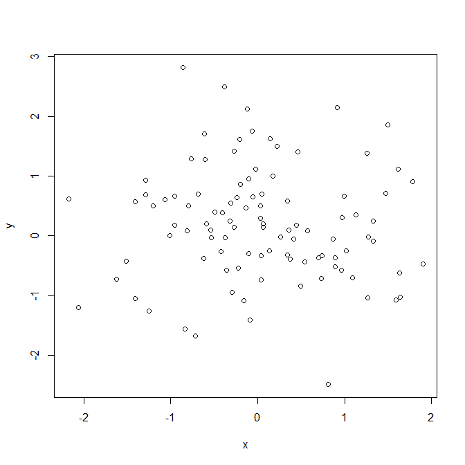
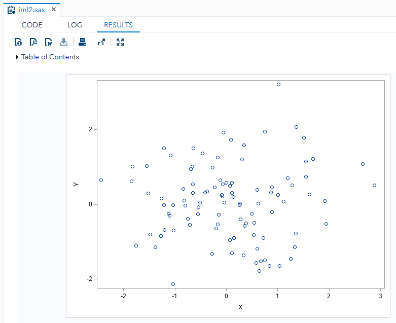
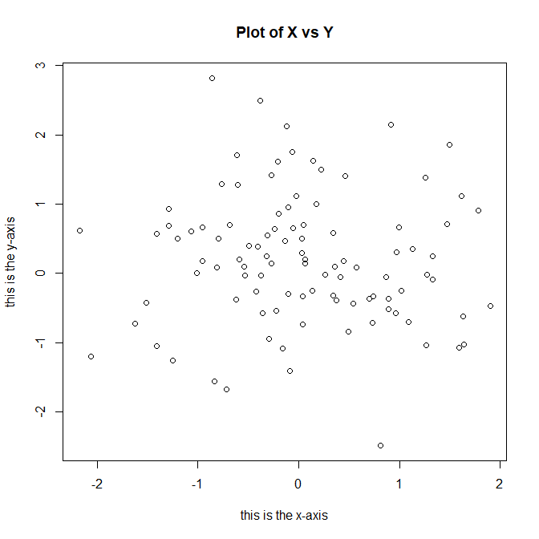
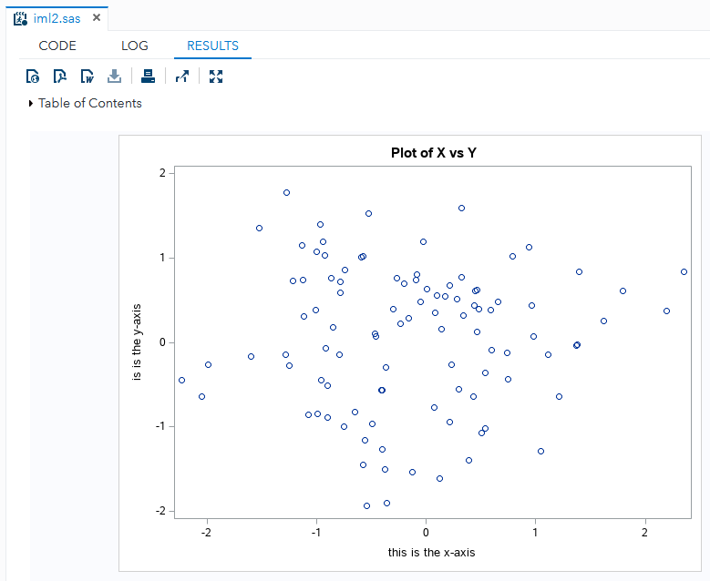
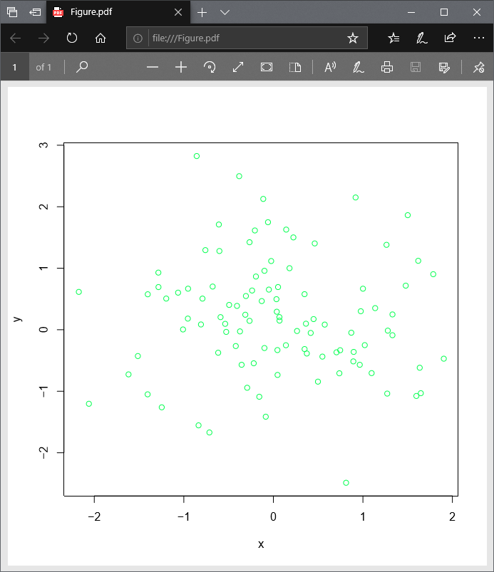
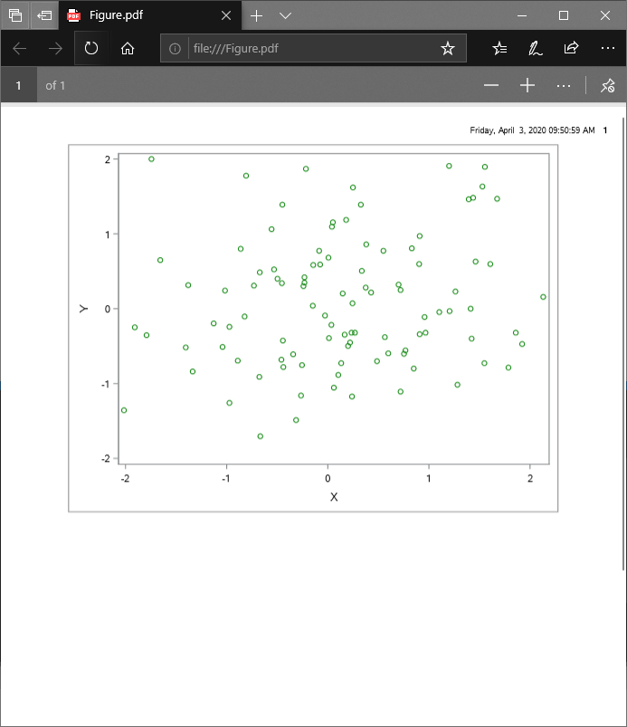
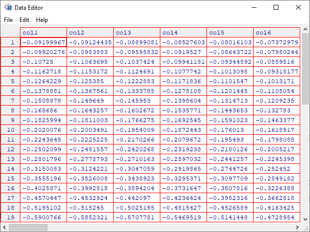
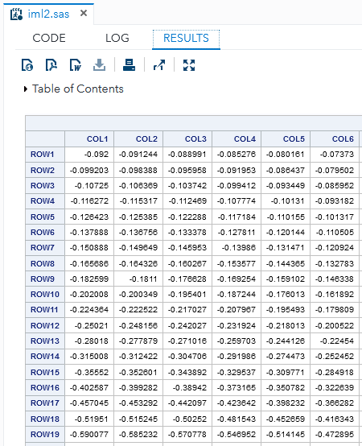
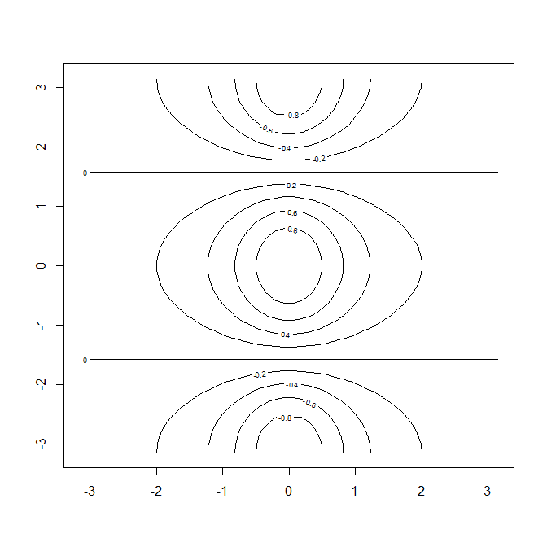
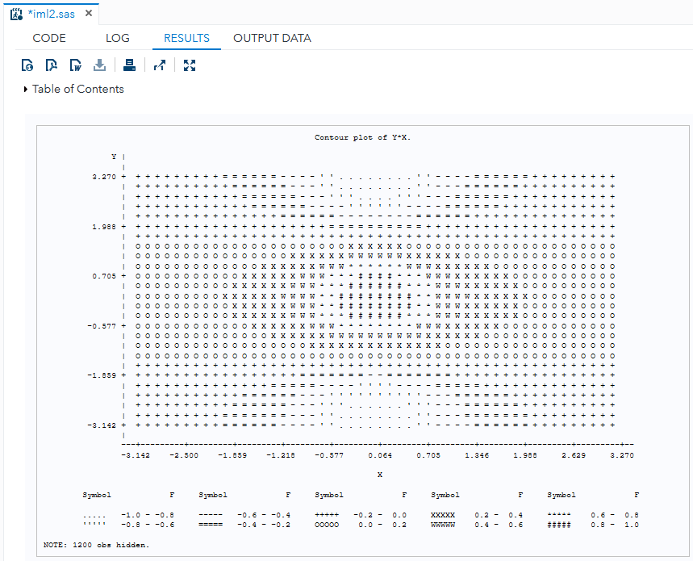

# ISL**R** Lab → SAS/IML

This is a record of exploring whether features of R can be reproduced in 
SAS/IML and so shall provide demonstrations where it does and alternatives 
where it doesn't. This is NOT intended to be a tutorial of any sort.

The *Lab* sections of ISLR 7th printing will be used as basis.

## Contents
* ISLR [2.3.1 Basic Commands](#2.3.1-Basic-Commands)
    * R [Declaring a vector](#declaring-a-vector-p.43)
    * SAS/IML [Row vectors vs column vectors](#row-vectors-vs-column-vectors)
    * R [Getting the vector length](#getting-the-vector-length-p.43)
    * R [Vector addition](#vector-addition-p.43)
    * R [Functions `ls(⋯)` and `rm(⋯)`](#functions-ls⋯-and-rm⋯-p.43)
    * R [Making a matrix](#making-a-matrix-p.44)
    * R [Function `sqrt(⋯)`](#function-sqrt⋯-p.44)
    * R [Caret operator (`^`)](#caret-operator-^-p.45)
    * R [Random numbers in normal distribution](#random-numbers-in-normal-distribution-p.45)
    * R [Function `set.seed(⋯)`](#function-set.seed⋯-p.45)
    * R [Functions `mean(⋯)`, `var(⋯)` and `sd(⋯)`](#functions-mean-var-and-sd-p.45)
* ISLR [2.3.2 Graphics](#2.3.2-Graphics)
    * R [Function `plot(⋯)`](#function-plot⋯-p.45)
    * R [Saving graphs](#saving-graphs-p.46)
    * R [Function `seq(⋯)`](#function-seq⋯-p.46)
    * R [Function `outer(⋯)`](#function-outer⋯-p.46)
    * R [Functions `contour(⋯)`, `image(⋯)` and `persp(⋯)`](#functions-contour⋯-image⋯-and-persp⋯-p.46)
* ISLR [2.3.3 Indexing Data](#2.3.3-indexing-data)
    * R [Member access](#member-access-p.47)
    * SAS/IML [Function `t(⋯)` (used in *Member access* example)](#member-access-p.47)
    * R [Function `dim(⋯)`](#function-dim⋯-p.48)
* ISLR [2.3.4 Loading Data](#2.3.4-loading-data)
    * R [Function `read.table(⋯)`](#function-read.table⋯-p.48)


---

## SAS/IML and R

It is possible to submit R statements in `proc iml`. However, such a feature 
must be enabled since it does not work out of the box. Documentation 
[here](https://documentation.sas.com/?docsetId=imlug&docsetTarget=imlug_r_sect001.htm&docsetVersion=14.3&locale=en).

**SAS University Edition**<br/>
The documentation explicitly states that:
>You cannot call R from the free SAS University Edition. The SAS University 
>Edition runs on a virtual machine that does not have R installed.

**Licensed environments**<br/>
The RLANG system option must be supported by the host. Documentation 
[here](https://documentation.sas.com/?docsetId=imlug&docsetTarget=imlug_r_sect003.htm&docsetVersion=14.3&locale=en).

---

## 2.3.1 Basic Commands

---

### Declaring a vector (p.43)

R code:
```r
x <- c(1,3,2,5)
x
```

R output:
```
[1] 1 3 2 5
```

SAS code:
```sas
proc iml;
    x = { 1, 3, 2, 5 };
    print x;
quit;
```

SAS log:
```
 73         proc iml;
 NOTE: IML Ready
 74             x = { 1, 3, 2, 5 };
 75             print x;
 76         quit;
 NOTE: Exiting IML.
 NOTE: PROCEDURE IML used (Total process time):
       real time           0.02 seconds
       cpu time            0.03 seconds
```

SAS results (HTML):
<table class="table" cellspacing="0" cellpadding="5" rules="all" frame="box" bordercolor="#C1C1C1" summary="Procedure IML: x">
<colgroup>
<col>
</colgroup>
<thead>
<tr>
<th class="c b header" scope="col">x</th>
</tr>
</thead>
<tbody>
<tr>
<td class="r data">1</td>
</tr>
<tr>
<td class="r data">3</td>
</tr>
<tr>
<td class="r data">2</td>
</tr>
<tr>
<td class="r data">5</td>
</tr>
</tbody>
</table>

---

### Row vectors vs column vectors

A vector in SAS/IML is a special matrix with dimensions of either *n*x1 "column 
vector" or 1×*p* "row vector". Documentation
[here](https://documentation.sas.com/?docsetId=imlug&docsetTarget=imlug_languagechap_sect001.htm&docsetVersion=14.3&locale=en).

In contrast, R does not natively distinguish 
between row vectors and column vectors.[*1]

> [*1] Needs verification: "R does not..."

SAS code (additional example):
```sas
proc iml;
    colv = { 1, 2, 3, 4 };
    print colv;

    rowv = { 1  2  3  4 };
    print rowv;
quit;
```

SAS result (HTML):
<table class="table" rules="all" frame="box" summary="Procedure IML: colv" cellspacing="0" cellpadding="5" bordercolor="#C1C1C1">
<colgroup>
<col>
</colgroup>
<thead>
<tr>
<th class="c b header" scope="col">colv</th>
</tr>
</thead>
<tbody>
<tr>
<td class="r data">1</td>
</tr>
<tr>
<td class="r data">2</td>
</tr>
<tr>
<td class="r data">3</td>
</tr>
<tr>
<td class="r data">4</td>
</tr>
</tbody>
</table>

<table class="table" rules="all" frame="box" summary="Procedure IML: rowv" cellspacing="0" cellpadding="5" bordercolor="#C1C1C1">
<colgroup>
<col>
<col>
<col>
<col>
</colgroup>
<thead>
<tr>
<th class="c b header" colspan="4" scope="colgroup">rowv</th>
</tr>
</thead>
<tbody>
<tr>
<td class="r data">1</td>
<td class="r data">2</td>
<td class="r data">3</td>
<td class="r data">4</td>
</tr>
</tbody>
</table>

Note how an explicitly-written row vector does not have commas.

---

### Getting the vector length (p.43)

R:
```
> x = c(1,6,2)
> y = c(1,4,3)
> length(x)
[1] 3
> length(y)
[1] 3
```
SAS code:
```sas
proc iml;
    x = { 1, 6, 2 };
    d = dimension(x);
    print "vector length of x" d;

    y = { 1, 4, 3 };
    d = dimension(y);
    print "vector length of y" d;
quit;
```

Print message added for distinction.

SAS results (HTML):
<table class="table" rules="all" frame="box" summary="Procedure IML: d" cellspacing="0" cellpadding="5" bordercolor="#C1C1C1">
<colgroup>
<col>
<col>
<col>
</colgroup>
<thead>
<tr>
<th class="c headerempty" scope="col">&nbsp;</th>
<th class="r b header" scope="col">d</th>
<th class="c headerempty" scope="col">&nbsp;</th>
</tr>
</thead>
<tbody>
<tr>
<td class="l data">vector length of x</td>
<td class="r data">3</td>
<td class="r data">1</td>
</tr>
</tbody>
</table>
<table class="table" rules="all" frame="box" summary="Procedure IML: d" cellspacing="0" cellpadding="5" bordercolor="#C1C1C1">
<colgroup>
<col>
<col>
<col>
</colgroup>
<thead>
<tr>
<th class="c headerempty" scope="col">&nbsp;</th>
<th class="r b header" scope="col">d</th>
<th class="c headerempty" scope="col">&nbsp;</th>
</tr>
</thead>
<tbody>
<tr>
<td class="l data">vector length of y</td>
<td class="r data">3</td>
<td class="r data">1</td>
</tr>
</tbody>
</table>

Note that the a result of the `dimension(m)` function are two numbers, for the 
number of rows and columns, respectively.

Aternatively if y is a row vector:

SAS code (additional example):
```sas
proc iml;
    y = { 1  4  3 };
    d = dimension(y);
    print "vector length of y" d;
quit;
```

SAS result (HTML):
<table class="table" rules="all" frame="box" summary="Procedure IML: d" cellspacing="0" cellpadding="5" bordercolor="#C1C1C1">
<colgroup>
<col>
<col>
<col>
</colgroup>
<thead>
<tr>
<th class="c headerempty" scope="col">&nbsp;</th>
<th class="r b header" scope="col">d</th>
<th class="c headerempty" scope="col">&nbsp;</th>
</tr>
</thead>
<tbody>
<tr>
<td class="l data">vector length of y</td>
<td class="r data">1</td>
<td class="r data">3</td>
</tr>
</tbody>
</table>

The result of the `dimension(m)` function is also a matrix. Documentation 
[here](https://documentation.sas.com/?docsetId=imlug&docsetTarget=imlug_langref_sect110.htm&docsetVersion=14.3&locale=en).

SAS/IML also has a length function, but does not give the length of a vector. 
Documentation 
[here](https://documentation.sas.com/?docsetId=imlug&docsetTarget=imlug_langref_sect215.htm&docsetVersion=14.3&locale=en).

---

### Vector addition (p.43)

R:
```
> x+y
[1] 2 10 5
```

SAS code:
```sas
proc iml;
    x = { 1, 6, 2 };
    y = { 1, 4, 3 };
    a = x + y;
    print a;
quit;
```

SAS result (HTML):
<table class="table" rules="all" frame="box" summary="Procedure IML: a" cellspacing="0" cellpadding="5" bordercolor="#C1C1C1">
<colgroup>
<col>
</colgroup>
<thead>
<tr>
<th class="c b header" scope="col">a</th>
</tr>
</thead>
<tbody>
<tr>
<td class="r data">2</td>
</tr>
<tr>
<td class="r data">10</td>
</tr>
<tr>
<td class="r data">5</td>
</tr>
</tbody>
</table>

Note that vector addition in SAS/IML is the same operation as matrix addition 
and requires that the two operands have exactly the same dimensions.

SAS code (additional example):
```sas
proc iml;
    x = { 1, 6, 2 };
    y = { 1  4  3 };
    a = x + y;
    print a;
quit;
```

SAS log:
```
 93         proc iml;
 NOTE: IML Ready
 94             x = { 1, 6, 2 };
 95             y = { 1  4  3 };
 96             a = x + y;
 ERROR: (execution) Matrices do not conform to the operation.
```

SAS/IML will not add an *n*×1 matrix and a 1×*p* matrix.

---

### Functions `ls(⋯)` and `rm(⋯)` (p.43)

R:
```
> ls()
[1] "x" "y"
> rm(x,y)
> ls()
character (0)
```

No parallel SAS/IML codes for `ls(⋯)` and `rm(⋯)` have been found yet.[*2]

> [*2] Needs verification

---

### Making a matrix (p.44)

R:
```
> x=matrix(data=c(1,2,3,4), nrow=2, ncol=2)
> x
     [,1] [,2]
[1,]    1    3
[2,]    2    4
```

SAS code:
```sas
proc iml;
    x = { 1 3, 2 4 };
    print x;
quit;
```

SAS result (HTML):
<table class="table" rules="all" frame="box" summary="Procedure IML: x" cellspacing="0" cellpadding="5" bordercolor="#C1C1C1">
<colgroup>
<col>
<col>
</colgroup>
<thead>
<tr>
<th class="c b header" colspan="2" scope="colgroup">x</th>
</tr>
</thead>
<tbody>
<tr>
<td class="r data">1</td>
<td class="r data">3</td>
</tr>
<tr>
<td class="r data">2</td>
<td class="r data">4</td>
</tr>
</tbody>
</table>

In SAS/IML, the syntax for explicit declaration is the same for matrices, 
vectors and scalars. Note how spaces and commas in the SAS/IML declaration 
arrange the items in the resulting matrix.

R:
```
> matrix (c(1,2,3,4),2,2,byrow=TRUE)
[,1] [,2]
[1,] 1 2
[2,] 3 4
```

SAS code:
```sas
proc iml;
    x = { 1 2, 3 4 };
    print x;
quit;
```

SAS result (HTML):
<table class="table" rules="all" frame="box" summary="Procedure IML: x" cellspacing="0" cellpadding="5" bordercolor="#C1C1C1">
<colgroup>
<col>
<col>
</colgroup>
<thead>
<tr>
<th class="c b header" colspan="2" scope="colgroup">x</th>
</tr>
</thead>
<tbody>
<tr>
<td class="r data">1</td>
<td class="r data">2</td>
</tr>
<tr>
<td class="r data">3</td>
<td class="r data">4</td>
</tr>
</tbody>
</table>

The behavior of the SAS/IML declaration seems to mimic the `byrow=TRUE` option 
in the R `matrix(⋯)` method. Which elements go to which row and column are 
controlled by where commas are placed. Documentation 
[here](https://documentation.sas.com/?docsetId=imlug&docsetTarget=imlug_workmatrix_sect002.htm&docsetVersion=14.3&locale=en).

The closest equivalent in SAS/IML is the `shape(⋯)` function. Documentation
[here](https://documentation.sas.com/?docsetId=imlug&docsetTarget=imlug_langref_sect441.htm&docsetVersion=14.3&locale=en).

---

### Function `sqrt(⋯)` (p.44)

R:
```
> sqrt(x)
     [,1] [,2]
[1,] 1.00 1.73
[2,] 1.41 2.00
```

SAS code: 
```sas
proc iml;
    x = { 1 3, 2 4};
    a = sqrt(x);
    print a;
quit;
```

SAS result (HTML):
<table class="table" rules="all" frame="box" summary="Procedure IML: a" cellspacing="0" cellpadding="5" bordercolor="#C1C1C1">
<colgroup>
<col>
<col>
</colgroup>
<thead>
<tr>
<th class="c b header" colspan="2" scope="colgroup">a</th>
</tr>
</thead>
<tbody>
<tr>
<td class="r data">1</td>
<td class="r data">1.7320508</td>
</tr>
<tr>
<td class="r data">1.4142136</td>
<td class="r data">2</td>
</tr>
</tbody>
</table>

The `sqrt(m)` function in SAS/IML seems the same as the `sqrt(⋯)` function in 
R. Documentation 
[here](https://documentation.sas.com/?docsetId=imlug&docsetTarget=imlug_langref_sect461.htm&docsetVersion=14.3&locale=en).

---

### Caret operator (`^`) (p.45)

R:
```
> x ^ 2
     [,1] [,2]
[1,]    1    9
[2,]    4   16
```

SAS code:
```sas
proc iml;
    x = { 1 3, 2 4};
    a = x ## 2;
    print a;
quit;
```

SAS result (HTML):
<table class="table" rules="all" frame="box" summary="Procedure IML: a" cellspacing="0" cellpadding="5" bordercolor="#C1C1C1">
<colgroup>
<col>
<col>
</colgroup>
<thead>
<tr>
<th class="c b header" colspan="2" scope="colgroup">a</th>
</tr>
</thead>
<tbody>
<tr>
<td class="r data">1</td>
<td class="r data">9</td>
</tr>
<tr>
<td class="r data">4</td>
<td class="r data">16</td>
</tr>
</tbody>
</table>

The elementwise power operator (`##` in `m ## s`) raises each element in matrix 
`m` to the scalar `s`-th power. Documentation
[here](https://documentation.sas.com/?docsetId=imlug&docsetTarget=imlug_langref_sect045.htm&docsetVersion=14.3&locale=en).

The caret operator in SAS/IML is a prefix operator for logical NOT. 
Documentation 
[here](https://documentation.sas.com/?docsetId=imlug&docsetTarget=imlug_langref_sect042.htm&docsetVersion=14.3&locale=en).

SAS/IML also has a matrix power operator (`**` in `m ** s`), which multiples a 
matrix `m` by itself `s` times. Documentation 
[here](https://documentation.sas.com/?docsetId=imlug&docsetTarget=imlug_langref_sect046.htm&docsetVersion=14.3&locale=en).

---

### Random numbers in normal distribution (p.45)

R:
```
> x=rnorm(50)
> y=x+rnorm(50,mean=50,sd=.1)
> cor(x,y)
[1] 0.995
```

SAS code:
```sas
proc iml;
    x = randfun(50, "Normal");
    y = x + randfun(50, "Normal", 50, 0.1);
    m = x || y;
    c = corr(m);
    print c;
quit;
```

SAS result (HTML):
<table class="table" rules="all" frame="box" summary="Procedure IML: c" cellspacing="0" cellpadding="5" bordercolor="#C1C1C1">
<colgroup>
<col>
<col>
</colgroup>
<thead>
<tr>
<th class="c b header" colspan="2" scope="colgroup">c</th>
</tr>
</thead>
<tbody>
<tr>
<td class="r data">1</td>
<td class="r data">0.9952377</td>
</tr>
<tr>
<td class="r data">0.9952377</td>
<td class="r data">1</td>
</tr>
</tbody>
</table>

The SAS/IML function `randfun(⋯)` may accept other types of distribution 
other than "Normal". Documentation 
[here](https://documentation.sas.com/?docsetId=imlug&docsetTarget=imlug_langref_sect336.htm&docsetVersion=14.3&locale=en).

There is also `randnormal(n, mean, cov)` that has a different third parameter. 
Documentation 
[here](https://documentation.sas.com/?docsetId=imlug&docsetTarget=imlug_langref_sect375.htm&docsetVersion=14.3&locale=en).

The `corr(⋯)` function computes a *sample* correlation. Accepts a matrix and 
outputs a matrix. The function does not accept mutiple vectors as in R. 
Multiple vectors must be combined into a *m*×*p* matrix. Documentation 
[here](https://documentation.sas.com/?docsetId=imlug&docsetTarget=imlug_langref_sect085.htm&docsetVersion=14.3&locale=en).

To put the column vectors x and y into once matrix they were concatenated using 
the horizontal concatenation operator `||`. Documentation 
[here](https://documentation.sas.com/?docsetId=imlug&docsetTarget=imlug_langref_sect032.htm&docsetVersion=14.3&locale=en).

---

### Function `set.seed(⋯)` (p.45)

R:
```
> set.seed(1303)
> rnorm(50)
[1] -1.1440 1.3421 2.1854 0.5364 0.0632 0.5022 -0.0004
...
```

Note that different builds of R (64-bit vs 32-bit, Windows vs Unix, etc.) may 
have differences in results. Consecutive calls to `rnorm(⋯)` will move the 
random number generator forward:

R (additional example):
```
> set.seed(1303)    # seed set to 1303
> rnorm(5)          # shows random numbers 1-5 for seed 1303
[1] -1.14397631  1.34212937  2.18539048  0.53639252  0.06319297
>
> set.seed(1303)    # seed set to 1303
> rnorm(5)          # shows random numbers 1-5 for seed 1303
[1] -1.14397631  1.34212937  2.18539048  0.53639252  0.06319297
>
> rnorm(5)          # shows random numbers 6-10 for seed 1303
[1]  0.5022344825 -0.0004167247  0.5658198405 -0.5725226890 -1.1102250073
>
> set.seed(1303)    # seed set to 1303
> rnorm(10)         # shows random numbers 1-10 for seed 1303
[1] -1.1439763145  1.3421293656  2.1853904757  0.5363925179  0.0631929665
[6]  0.5022344825 -0.0004167247  0.5658198405 -0.5725226890 -1.1102250073
```

> Computers are deterministic at the core and predictability is in 
> the design. True randomness comes outside from the system as an input 
> — a "true random" computer only *gets* this input in an automated manner 
> (e.g., atmospheric sensor data, quantum phenomena). 
> [Ask an engineer](https://engineering.mit.edu/engage/ask-an-engineer/can-a-computer-generate-a-truly-random-number/).
>
> The 
> [`RDRAND` instruction](https://en.wikipedia.org/wiki/RDRAND)
> which is available in modern, publicly-available CPUs  uses thermal noise 
> within the silicon to seed its random number generator. The random factor is 
> still an input, and any random number generated from this scheme does not 
> come from pure calculation. *The CPU itself does not make the random, it gets 
> the random from somewhere else.*

SAS code:

```sas
proc iml;
    call randseed(1303);
    x = randfun(5, "Normal");
    print x;
quit;
```

SAS result (HTML):
<table class="table" rules="all" frame="box" summary="Procedure IML: x" cellspacing="0" cellpadding="5" bordercolor="#C1C1C1">
<colgroup>
<col>
</colgroup>
<thead>
<tr>
<th class="c b header" scope="col">x</th>
</tr>
</thead>
<tbody>
<tr>
<td class="r data">0.2875899</td>
</tr>
<tr>
<td class="r data" nowrap="">-0.685311</td>
</tr>
<tr>
<td class="r data" nowrap="">-2.033587</td>
</tr>
<tr>
<td class="r data" nowrap="">-1.019879</td>
</tr>
<tr>
<td class="r data" nowrap="">-0.269627</td>
</tr>
</tbody>
</table>

Note how SAS/IML has a different result from random numbers generated in R even 
for the same seed value.

The `randseed(⋯)` call will only reset SAS's random number generation only 
if a true value is passed as a second argument. Documentation
[here](https://documentation.sas.com/?docsetId=imlug&docsetTarget=imlug_langref_sect379.htm&docsetVersion=14.3&locale=en).

SAS code (additional example):
```sas
proc iml;
    call randseed(1303);
    run1 = randfun(5, "Normal");     * generates random numbers 1-5 ;
    run2 = randfun(5, "Normal");     * generates random numbers 6-10 ;
    
    call randseed(1303, 1);          * resets the RNG ;
    run3 = randfun(10, "Normal");    * generates random numbers 1-10 ;
    
    print run1 run2 run3;
quit;
```

SAS result (HTML):
<table class="table" rules="all" frame="box" summary="Procedure IML: run1_run2_run3" cellspacing="0" cellpadding="5" bordercolor="#C1C1C1">
<colgroup>
<col>
<col>
<col>
</colgroup>
<thead>
<tr>
<th class="r b header" scope="col">run1</th>
<th class="r b header" scope="col">run2</th>
<th class="r b header" scope="col">run3</th>
</tr>
</thead>
<tbody>
<tr>
<td class="r data">0.2875899</td>
<td class="r data">0.269403</td>
<td class="r data">0.2875899</td>
</tr>
<tr>
<td class="r data" nowrap="">-0.685311</td>
<td class="r data">0.6187675</td>
<td class="r data" nowrap="">-0.685311</td>
</tr>
<tr>
<td class="r data" nowrap="">-2.033587</td>
<td class="r data" nowrap="">-0.217801</td>
<td class="r data" nowrap="">-2.033587</td>
</tr>
<tr>
<td class="r data" nowrap="">-1.019879</td>
<td class="r data" nowrap="">-0.540015</td>
<td class="r data" nowrap="">-1.019879</td>
</tr>
<tr>
<td class="r data" nowrap="">-0.269627</td>
<td class="r data">1.4973863</td>
<td class="r data" nowrap="">-0.269627</td>
</tr>
<tr>
<td class="r data">&nbsp;</td>
<td class="r data">&nbsp;</td>
<td class="r data">0.269403</td>
</tr>
<tr>
<td class="r data">&nbsp;</td>
<td class="r data">&nbsp;</td>
<td class="r data">0.6187675</td>
</tr>
<tr>
<td class="r data">&nbsp;</td>
<td class="r data">&nbsp;</td>
<td class="r data" nowrap="">-0.217801</td>
</tr>
<tr>
<td class="r data">&nbsp;</td>
<td class="r data">&nbsp;</td>
<td class="r data" nowrap="">-0.540015</td>
</tr>
<tr>
<td class="r data">&nbsp;</td>
<td class="r data">&nbsp;</td>
<td class="r data">1.4973863</td>
</tr>
</tbody>
</table>

---

### Functions `mean(⋯)`, `var(⋯)` and `sd(⋯)` (p.45)

Note that these examples uses random number generators and will have different 
results.

R:
```
> set.seed(3)
> y=rnorm(100)
> mean(y)
[1] 0.0110
> var(y)
[1] 0.7329
> sqrt(var(y))
[1] 0.8561
> sd(y)
[1] 0.8561
```

SAS code:
```sas
proc iml;
    call randseed(3);
    y = randfun(100, "Normal");

    a = mean(y);
    print "sample mean" a;

    a = var(y);
    print "sample variance" a;

    a = std(y);
    print "sample standard deviation" a;

quit;
```

SAS results (HTML):
<table class="table" rules="all" frame="box" summary="Procedure IML: a" cellspacing="0" cellpadding="5" bordercolor="#C1C1C1">
<colgroup>
<col>
<col>
</colgroup>
<thead>
<tr>
<th class="c headerempty" scope="col">&nbsp;</th>
<th class="r b header" scope="col">a</th>
</tr>
</thead>
<tbody>
<tr>
<td class="l data">sample mean</td>
<td class="r data" nowrap="">-0.168063</td>
</tr>
</tbody>
</table>

<table class="table" rules="all" frame="box" summary="Procedure IML: a" cellspacing="0" cellpadding="5" bordercolor="#C1C1C1">
<colgroup>
<col>
<col>
</colgroup>
<thead>
<tr>
<th class="c headerempty" scope="col">&nbsp;</th>
<th class="r b header" scope="col">a</th>
</tr>
</thead>
<tbody>
<tr>
<td class="l data">sample variance</td>
<td class="r data">1.2183335</td>
</tr>
</tbody>
</table>

<table class="table" rules="all" frame="box" summary="Procedure IML: a" cellspacing="0" cellpadding="5" bordercolor="#C1C1C1">
<colgroup>
<col>
<col>
</colgroup>
<thead>
<tr>
<th class="c headerempty" scope="col">&nbsp;</th>
<th class="r b header" scope="col">a</th>
</tr>
</thead>
<tbody>
<tr>
<td class="l data">sample standard deviation</td>
<td class="r data">1.1037815</td>
</tr>
</tbody>
</table>

The three R functions showcased have built-in parrallels in SAS/IML:

Sample mean `mean(m, method, param)` documentation
[here](https://documentation.sas.com/?docsetId=imlug&docsetTarget=imlug_langref_sect253.htm&docsetVersion=14.3&locale=en).

Sample variance `var(m))` documentation
[here](https://documentation.sas.com/?docsetId=imlug&docsetTarget=imlug_langref_sect525.htm&docsetVersion=14.3&locale=en).

Sample standard deviation `std(m))` documentation
[here](https://documentation.sas.com/?docsetId=imlug&docsetTarget=imlug_langref_sect466.htm&docsetVersion=14.3&locale=en).

---

## 2.3.2 Graphics

---

### Function `plot(⋯)` (p.45)

R:
```
> x=rnorm(100)
> y=rnorm(100)
> plot(x,y)
```

R display:



SAS code:
```sas
proc iml;
    x = randfun(100, "Normal");
    y = randfun(100, "Normal");
    run scatter(x, y);
quit;
```

SAS results (SAS Studio screenshot):



R:
```
> plot(x,y,xlab="this is the x-axis",ylab="this is the y-axis", main="Plot of X vs Y")
```

R display:



SAS code:
```sas
proc iml;
    x = randfun(100, "Normal");
    y = randfun(100, "Normal");
    
    title "Plot of X vs Y";
    run scatter(x, y) label={"this is the x-axis" "is is the y-axis"};
    title;    * clears the title text ;
quit;
```

SAS result (SAS Studio screenshot):



The SAS/IML `scatter(⋯)` call uses an underlying `proc sgplot` but *"is not a 
comprehensive interface to the SGPLOT procedure"*. Documentation
[here](https://documentation.sas.com/?docsetId=imlug&docsetTarget=imlug_langref_sect423.htm&docsetVersion=14.3&locale=en).

More complex graphs must be done outside of `proc iml`.


---

### Saving graphs (p.46)

In this section, paths have been truncated.

R:
```
> pdf("Figure.pdf")
> plot(x,y,col="green")
> dev.off()
```

R output (PDF viewer screenshot):



SAS code:
```sas
ods pdf file='Figure.pdf';

proc iml;
    x = randfun(100, "Normal");
    y = randfun(100, "Normal");
    
    run scatter(x, y) option="markerattrs=(color=green)";
quit;

ods pdf close;
```

SAS result (PDF viewer screenshot):



Controlling the output destination and file type occurs outside of the `proc iml` code 
block. 
<br/>
ODS statements are not part of SAS/IML.

---

### Function `seq(⋯)` (p.46)

R:
```
> x=seq(1,10)
> x
[1] 1 2 3 4 5 6 7 8 9 10
> x=1:10
> x
[1] 1 2 3 4 5 6 7 8 9 10
```

SAS code:
```sas
proc iml;
    x = {};            * an empty matrix ;
    
    do i = 1 to 10;
        x = x // i;    * row concatenation ;
    end;

    * x is now a column vector ;
    
    print x;
quit;
```

SAS result (HTML):
<table class="table" rules="all" frame="box" summary="Procedure IML: x" cellspacing="0" cellpadding="5" bordercolor="#C1C1C1">
<colgroup>
<col>
</colgroup>
<thead>
<tr>
<th class="c b header" scope="col">x</th>
</tr>
</thead>
<tbody>
<tr>
<td class="r data">1</td>
</tr>
<tr>
<td class="r data">2</td>
</tr>
<tr>
<td class="r data">3</td>
</tr>
<tr>
<td class="r data">4</td>
</tr>
<tr>
<td class="r data">5</td>
</tr>
<tr>
<td class="r data">6</td>
</tr>
<tr>
<td class="r data">7</td>
</tr>
<tr>
<td class="r data">8</td>
</tr>
<tr>
<td class="r data">9</td>
</tr>
<tr>
<td class="r data">10</td>
</tr>
</tbody>
</table>

In the above SAS code, declaring an empty matrix is not required but added for readability.

There is no SAS/IML direct equivalent for R's `seq(⋯)` function. 
The `seq(⋯)` call available in SAS/IML "compute[s] the probability from a 
sequential test". Documentation
[here](https://documentation.sas.com/?docsetId=imlug&docsetTarget=imlug_langref_sect424.htm&docsetVersion=14.3&locale=en).

As an alternative, number sequences can be created using a DO loop. Documentation 
[here](https://documentation.sas.com/?docsetId=imlug&docsetTarget=imlug_programstatements_sect006.htm&docsetVersion=14.3&locale=en).

There is also a `do(start, stop, increment)` function that simplifies the DO 
loop method of creating a sequence, but it is limited to creating row vectors. 
Note that the third parameter is the value used as increment.

As for the colon (`:`) operator, SAS/IML can only create row vectors from this 
notation. Documentation 
[here](https://documentation.sas.com/?docsetId=imlug&docsetTarget=imlug_workmatrix_sect014.htm&docsetVersion=14.3&locale=en).

---

### Function `outer(⋯)`  (p.46)

R:
```
> x=seq(-pi,pi,length=50)
> y=x
> f=outer(x,y,function (x,y)cos(y)/(1+x^2))
```

R display (screenshot of `fix(f)`, showing 19x6 of a 50x50 matrix):



SAS/IML supports the operation 
[direct product](https://documentation.sas.com/?docsetId=imlug&docsetTarget=imlug_langref_sect034.htm&docsetVersion=14.3&locale=en) 
(which it equates to Konecker product[*3]) 
using the binary operator `@`, and will work like `outer(⋯)` when given input 
vectors. However, this operation may not give the same result dimensions as 
`outer(⋯)` and it does not allow for custom functions.

> [*3] The documentation shows that the operation is actually for the 
> [Kronecker product](https://en.wikipedia.org/wiki/Kronecker_product).
> Compare with 
> [Direct product](https://en.wikipedia.org/wiki/Direct_product).

The SAS code below instead uses a nested `DO` loop to apply the custom 
function in the R example above for each result element of the outer product.

SAS code:
```sas
proc iml;

    x = {};                              * an empty matrix;
    
    * create 50 numbers of [-π, π] ;
    count = 50;
    pi = constant("pi");
    inc = (pi - (-pi)) / (count - 1);    
    do i = -pi to pi by inc;
        x = x // i;                      * row concatenation ;
    end;
    
    * x now has 50 numbers from -π to π, inclusive ;

    y = x;

    f = j(count, count, 0);              * creates a 50*50 matrix where each element = 0 ;
    
    * the outer product for vectors x and y will be applied to f ;    
    * apply custom function cos(y)/(1+x^2) ;
    do i = 1 to count;
        do j = 1 to count;
            f[i,j] = cos(y[j]) / (1 + x[i] ## 2);
        end;
    end;
    
    * f now has results of outer product of x and y with function cos(y)/(1+x^2) ;

quit;
```

SAS result (SAS Studio screenshot of `print f`, showing 19x6 of a 50x50 matrix):



The SAS/IML constant for pi is loaded using the `constant("name")` function. Documentation
[here](https://blogs.sas.com/content/iml/2012/01/23/constants-in-sas.html).

Creating 50 numbers from -pi to pi inclusive used a `DO` loop with a custom increment in 
the `BY` clause.

The declaration for `x` containing an empty matrix is not required, but the declaration for 
`f` is required so the member access in the nested `DO` loop can work.

---

### Functions `contour(⋯)`, `image(⋯)` and `persp(⋯)` (p.46)

R:
```
> contour(x,y,f)
> contour (x,y,f,nlevels=45,add=T)
> fa=(f-t(f))/2
> contour(x,y,fa,nlevels=15)
> image(x,y,fa)
> persp(x,y,fa)
```

R output (only for `contour(x,y,f)`):



SAS/IML does not have parallels for R's `contour(⋯)`, `image(⋯)` and `persp(⋯)` 
functions like SAS/IML's `scatter(⋯)` for R's `plot(⋯)`.

These graphs may be created using other SAS products outside of SAS/IML. However, it is 
possible to use these statements inside the `proc iml` code block. Documentation
[here](https://documentation.sas.com/?docsetId=imlug&docsetTarget=imlug_graphics_sect002.htm&docsetVersion=14.3&locale=en).

These features outside of SAS/IML may need to have their input data in a dataset instead of 
a matrix. Below is an example of using `proc plot` to recreate `contour(x,y,f)` in the R 
code section above. This method only allows levels 1 to 10, `nlevels=45` cannot be 
reproduced. 

SAS code:
```sas
proc iml;

    x = {};                                            * an empty matrix;
    
    * create 50 numbers of [-π, π] ;
    count = 50;
    pi = constant("pi");
    inc = (pi - (-pi)) / (count - 1);    
    do i = -pi to pi by inc;
        x = x // i;                                    * row concatenation ;
    end;
    
    * x now has 50 numbers from -π to π, inclusive ;

    y = x;

    *f = j(count, count, 0);              
    f = {};                                            * empty instead of a 50x50 matrix ;
    
    * the outer product for vectors x and y will be applied to f ;    
    * apply custom function cos(y)/(1+x^2) ;
    do i = 1 to count;
        do j = 1 to count;
            * f[i,j] = cos(y[j]) / (1 + x[i] ## 2);    * not a matrix anymore;
            f = f // (x[i] || y[j] || cos(y[j]) / (1 + x[i] ## 2));
        end;
    end;
    
    * f is now a 2500x3 matrix ;
    
    * create a dataset for use in proc gcontour ;
    create Example from f[colname={"X" "Y" "F"}]; 
        append from f;
    close Example;
    
    submit;
        proc plot data=Example;
            plot y*x=f / contour=10;
        run;
    endsubmit;

quit;
```

SAS result (SAS Studio screenshot):



Note the following:
* the 50x50 matrix needs to be in a 2500x3 dataset in order to be used outside of `proc iml`
* `proc plot` did not produce contour lines
* `proc plot` approximated graph areas into characters

Alternative methods may render better-looking plots.

Alternatives:
* For `contour(⋯)` and `image(⋯)`
    * SAS/BASE `proc plot` [[doc]](https://documentation.sas.com/?docsetId=proc&docsetTarget=n0ea8hubm3lupxn12ev3ohujbn37.htm&docsetVersion=9.4&locale=en)
    * SAS ODS Graphics `proc template` & `proc sgrender` (GTL `contourplotparm`) [[post]](https://blogs.sas.com/content/iml/2012/07/02/create-a-contour-plot-in-sas.html)
    * SAS/GRAPH `proc gcontour` [[doc]]()
* For `persp(⋯)` 
    * SAS/GRAPH `proc g3d` [[doc]](https://documentation.sas.com/?docsetId=graphref&docsetVersion=9.4&docsetTarget=n17v6b90qsbjz1n16wqtuol0pic5.htm&locale=en)

> SAS/GRAPH procedures are not available in SAS University Edition

---

## 2.3.3 Indexing Data

---

### Member access (p.47)

Member access in SAS/IML matrices are done using `[]` "subscripts" similar to R.
Negative index values do not work.

R:
```
> A = matrix(1:16,4,4)
> A
     [,1] [,2] [,3] [,4]
[1,]    1    5    9   13
[2,]    2    6   10   14
[3,]    3    7   11   15
[4,]    4    8   12   16
```

SAS code:
```sas
proc iml;

    a = t(shape(1:16, 4, 4));
    print a;
    
    b = a[2, 3];
    print b;

quit;
```

SAS result (HTML):
<table class="table" rules="all" frame="box" summary="Procedure IML: a" cellspacing="0" cellpadding="5" bordercolor="#C1C1C1">
<colgroup>
<col>
<col>
<col>
<col>
</colgroup>
<thead>
<tr>
<th class="c b header" colspan="4" scope="colgroup">a</th>
</tr>
</thead>
<tbody>
<tr>
<td class="r data">1</td>
<td class="r data">5</td>
<td class="r data">9</td>
<td class="r data">13</td>
</tr>
<tr>
<td class="r data">2</td>
<td class="r data">6</td>
<td class="r data">10</td>
<td class="r data">14</td>
</tr>
<tr>
<td class="r data">3</td>
<td class="r data">7</td>
<td class="r data">11</td>
<td class="r data">15</td>
</tr>
<tr>
<td class="r data">4</td>
<td class="r data">8</td>
<td class="r data">12</td>
<td class="r data">16</td>
</tr>
</tbody>
</table>

<table class="table" rules="all" frame="box" summary="Procedure IML: b" cellspacing="0" cellpadding="5" bordercolor="#C1C1C1">
<colgroup>
<col>
</colgroup>
<thead>
<tr>
<th class="c b header" scope="col">b</th>
</tr>
</thead>
<tbody>
<tr>
<td class="r data">10</td>
</tr>
</tbody>
</table>

Note that to reproduce the R output ins SAS/IML the output of the `shape(⋯)` 
function must be transposed using the `t(⋯)` function.

R:
```
> A[c(1,3),c(2,4)]
     [,1] [,2]
[1,]    5   13
[2,]    7   15
> A[1:3,2:4]
     [,1] [,2] [,3]
[1,]    5    9   13
[2,]    6   10   14
[3,]    7   11   15
> A[1:2,]
     [,1] [,2] [,3] [,4]
[1,]    1    5    9   13
[2,]    2    6   10   14
> A[,1:2]
     [,1] [,2]
[1,]    1    5
[2,]    2    6
[3,]    3    7
[4,]    4    8
> A[1,]
[1]  1  5  9 13
```

SAS code:
```sas
proc iml;

    a = t(shape(1:16, 4, 4));
    print a;
    
    b = a[{1 3}, {2 4}];
    print b;
    
    b = a[1:3, 2:4];
    print b;
    
    b = a[1:2, ];
    print b;
    
    b = a[, 1:2];
    print b;
    
    b = a[1, ];
    print b;

quit;
```

SAS result (HTML):
<table class="table" rules="all" frame="box" summary="Procedure IML: b" cellspacing="0" cellpadding="5" bordercolor="#C1C1C1">
<colgroup>
<col>
<col>
</colgroup>
<thead>
<tr>
<th class="c b header" colspan="2" scope="colgroup">b</th>
</tr>
</thead>
<tbody>
<tr>
<td class="r data">5</td>
<td class="r data">13</td>
</tr>
<tr>
<td class="r data">7</td>
<td class="r data">15</td>
</tr>
</tbody>
</table>

<table class="table" rules="all" frame="box" summary="Procedure IML: b" cellspacing="0" cellpadding="5" bordercolor="#C1C1C1">
<colgroup>
<col>
<col>
<col>
</colgroup>
<thead>
<tr>
<th class="c b header" colspan="3" scope="colgroup">b</th>
</tr>
</thead>
<tbody>
<tr>
<td class="r data">5</td>
<td class="r data">9</td>
<td class="r data">13</td>
</tr>
<tr>
<td class="r data">6</td>
<td class="r data">10</td>
<td class="r data">14</td>
</tr>
<tr>
<td class="r data">7</td>
<td class="r data">11</td>
<td class="r data">15</td>
</tr>
</tbody>
</table>

<table class="table" rules="all" frame="box" summary="Procedure IML: b" cellspacing="0" cellpadding="5" bordercolor="#C1C1C1">
<colgroup>
<col>
<col>
<col>
<col>
</colgroup>
<thead>
<tr>
<th class="c b header" colspan="4" scope="colgroup">b</th>
</tr>
</thead>
<tbody>
<tr>
<td class="r data">1</td>
<td class="r data">5</td>
<td class="r data">9</td>
<td class="r data">13</td>
</tr>
<tr>
<td class="r data">2</td>
<td class="r data">6</td>
<td class="r data">10</td>
<td class="r data">14</td>
</tr>
</tbody>
</table>

<table class="table" rules="all" frame="box" summary="Procedure IML: b" cellspacing="0" cellpadding="5" bordercolor="#C1C1C1">
<colgroup>
<col>
<col>
</colgroup>
<thead>
<tr>
<th class="c b header" colspan="2" scope="colgroup">b</th>
</tr>
</thead>
<tbody>
<tr>
<td class="r data">1</td>
<td class="r data">5</td>
</tr>
<tr>
<td class="r data">2</td>
<td class="r data">6</td>
</tr>
<tr>
<td class="r data">3</td>
<td class="r data">7</td>
</tr>
<tr>
<td class="r data">4</td>
<td class="r data">8</td>
</tr>
</tbody>
</table>

<table class="table" rules="all" frame="box" summary="Procedure IML: b" cellspacing="0" cellpadding="5" bordercolor="#C1C1C1">
<colgroup>
<col>
<col>
<col>
<col>
</colgroup>
<thead>
<tr>
<th class="c b header" colspan="4" scope="colgroup">b</th>
</tr>
</thead>
<tbody>
<tr>
<td class="r data">1</td>
<td class="r data">5</td>
<td class="r data">9</td>
<td class="r data">13</td>
</tr>
</tbody>
</table>

Vectors may also be used as indices.

R:
```
>  A[-c(1,3) ,]
     [,1] [,2] [,3] [,4]
[1,]    2    6   10   14
[2,]    4    8   12   16
```

SAS code:
```sas
proc iml;

    a = t(shape(1:16, 4, 4));
    print a;
    
    b = a[{-1 -3}];
    print b;

quit;
```

SAS log:
```
 217        proc iml;
 NOTE: IML Ready
 218        
 219        
 219      !  a = t(shape(1:16, 4, 4));
 220        
 220      !  print a;
 221        
 222        
 222      !  b = a[{-1 -3}];
 ERROR: (execution) Invalid subscript or subscript out of range.
```

Negative index values do not work.

Subscript documentation [here](https://documentation.sas.com/?docsetId=imlug&docsetTarget=imlug_workmatrix_sect019.htm&docsetVersion=14.3&locale=en).

---

### Function `dim(⋯)` (p.48)

R:
```
> dim(A)
[1] 4 4
```

SAS code:
```sas
proc iml;

    a = t(shape(1:16, 4, 4));
    
    d = dimension(a);
    print d;
    
quit;
```

SAS result (HTML):
<table class="table" rules="all" frame="box" summary="Procedure IML: d" cellspacing="0" cellpadding="5" bordercolor="#C1C1C1">
<colgroup>
<col>
<col>
</colgroup>
<thead>
<tr>
<th class="c b header" colspan="2" scope="colgroup">d</th>
</tr>
</thead>
<tbody>
<tr>
<td class="r data">4</td>
<td class="r data">4</td>
</tr>
</tbody>
</table>

The parallel SAS/IML `dimension(m)` function returns a row vector for row and 
column dimensions of the argument matrix `m`. Documentation 
[here](https://documentation.sas.com/?docsetId=imlug&docsetTarget=imlug_langref_sect110.htm&docsetVersion=14.3&locale=en);

---

## 2.3.4 Loading Data

---

### Function `read.table(⋯)` (p.48)

R:
```
> Auto=read.table("Auto.data")
```

SAS code:
```sas

```

> TODO

<!--
middle ellipsis ⋯

> [*4]
-->